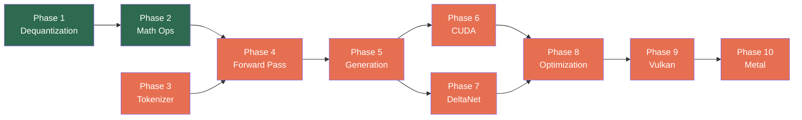

# daisi-llama

A ground-up C# reimplementation of llama.cpp targeting .NET 10. Native performance through direct hardware access — SIMD intrinsics on CPU, raw P/Invoke to CUDA/Vulkan/Metal on GPU. No managed wrapper libraries, no ONNX, no Python.

## Platform Support

| Platform | Backend | Status |
|----------|---------|--------|
| Windows x64 | CPU (AVX2/AVX-512) | Priority |
| Windows x64 | CUDA 13 (NVIDIA) | Priority |
| Linux x64 | CPU (AVX2/AVX-512) | Planned |
| Linux x64 | Vulkan (NVIDIA/AMD/Intel) | Planned |
| macOS arm64 | Metal (Apple Silicon) | Planned |
| macOS x64 | Metal (Intel/AMD) | Planned |
| iOS arm64 | Metal (XCFramework) | Planned |

## Quick Start

```bash
# Build
dotnet build

# Run tests (requires Qwen 3.5 0.8B Q8_0 in C:\GGUFS)
dotnet test

# Generate text (available after Phase 5)
dotnet run --project src/Daisi.Llama.Cli -- \
    --model C:\GGUFS\Qwen3.5-0.8B-Q8_0.gguf \
    --prompt "Hello, world"
```

### Test model

Tests validate against [Qwen 3.5 0.8B Q8_0](https://huggingface.co/unsloth/Qwen3.5-0.8B-GGUF). Download the GGUF file to `C:\GGUFS\Qwen3.5-0.8B-Q8_0.gguf`. Tests that require the model skip gracefully if the file is not present.

## Current Status

**GGUF parser: complete.** The parser reads GGUF v2/v3 files — header, metadata KV pairs (all 13 value types), tensor info descriptors, and lazy tensor data access. Validated against Qwen 3.5 0.8B Q8_0 with 18 passing tests (unit + integration).

What works today:
- Parse any GGUF v2/v3 file (header, metadata, tensor info)
- Query model metadata (architecture, dimensions, vocab)
- Read tensor data on demand (lazy loading)
- Full quantization type support (41 GgmlType variants with block/type size calculation)
- `IComputeBackend` and `ITensor` compute abstraction interfaces
- CPU backend with dequantization for Q8_0, Q4_0, Q4_K (AVX2 SIMD + scalar fallback)
- Load quantized tensors from GGUF and dequantize to FP32
- CPU SIMD math operations: MatMul (FP32 + fused Q8_0), RMSNorm, softmax, SiLU, RoPE, element-wise add/mul

## Roadmap



| Phase | Name | Goal | Status |
|-------|------|------|--------|
| 0 | [GGUF Parser](#current-status) | Parse GGUF files, read metadata and tensor info | Done |
| 1 | [Dequantization](docs/roadmap/phase-01-dequantization.md) | `IComputeBackend` + CPU dequantization (Q8_0, Q4_0, Q4_K) | Done |
| 2 | [Math Ops](docs/roadmap/phase-02-math-ops.md) | CPU SIMD matmul, RMSNorm, softmax, SiLU, RoPE | Done |
| 3 | [Tokenizer](docs/roadmap/phase-03-tokenizer.md) | BPE tokenizer from GGUF metadata | Done |
| 4 | [Forward Pass](docs/roadmap/phase-04-forward-pass.md) | Model loading + transformer forward pass | Not started |
| 5 | [Generation](docs/roadmap/phase-05-generation.md) | Sampling, KV cache, text generation, CLI | Not started |
| 6 | [CUDA](docs/roadmap/phase-06-cuda.md) | NVIDIA GPU backend with fused kernels | Not started |
| 7 | [DeltaNet](docs/roadmap/phase-07-deltanet.md) | Qwen 3.5 hybrid DeltaNet architecture | Not started |
| 8 | [Optimization](docs/roadmap/phase-08-optimization.md) | Mmap loading, batch prefill, KV cache quantization | Not started |
| 9 | [Vulkan](docs/roadmap/phase-09-vulkan.md) | Cross-platform GPU backend (Windows/Linux) | Not started |
| 10 | [Metal](docs/roadmap/phase-10-metal.md) | Apple GPU backend (macOS/iOS) | Not started |

## Documentation

| Document | Description |
|----------|-------------|
| [Definitions](docs/definitions.md) | Glossary of all key terms |
| [Architecture](docs/architecture.md) | Solution structure, backend abstraction, data flow |
| [GGUF Format](docs/gguf-format.md) | Binary format deep dive with byte-level layouts |
| [Inference Pipeline](docs/inference-pipeline.md) | Complete walkthrough: tokenize → forward pass → sample |
| [CUDA Backend](docs/cuda-backend.md) | P/Invoke design, kernel compilation, fused operations |
| [DeltaNet](docs/deltanet.md) | Gated DeltaNet linear attention and hybrid architecture |

## Solution Structure

```
daisi-llama/
├── src/
│   ├── Daisi.Llama/            Core library (GGUF, model, inference, tokenizer)
│   ├── Daisi.Llama.Cpu/        CPU compute backend (SIMD)
│   ├── Daisi.Llama.Cuda/       NVIDIA CUDA backend
│   ├── Daisi.Llama.Vulkan/     Vulkan compute backend
│   ├── Daisi.Llama.Metal/      Apple Metal backend
│   └── Daisi.Llama.Cli/        Command-line interface
├── tests/
│   └── Daisi.Llama.Tests/      Unit and integration tests
└── docs/                        Architecture and roadmap documentation
```

## License

MIT License. Copyright 2026 DAISI.
