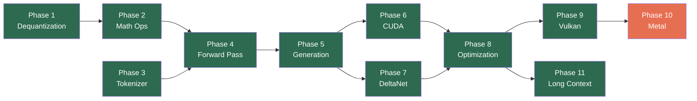

# daisi-llogos

A ground-up C# reimplementation of llama.cpp targeting .NET 10. Native performance through direct hardware access — SIMD intrinsics on CPU, raw P/Invoke to CUDA/Vulkan/Metal on GPU. No managed wrapper libraries, no ONNX, no Python.

## Platform Support

| Platform | Backend | Status |
|----------|---------|--------|
| Windows x64 | CPU (AVX2/AVX-512) | Priority |
| Windows x64 | CUDA 13 (NVIDIA) | Priority |
| Windows x64 | Vulkan (NVIDIA/AMD/Intel) | Done |
| Linux x64 | CPU (AVX2/AVX-512) | Planned |
| Linux x64 | Vulkan (NVIDIA/AMD/Intel) | Planned |
| macOS arm64 | Metal (Apple Silicon) | Planned |
| macOS x64 | Metal (Intel/AMD) | Planned |
| iOS arm64 | Metal (XCFramework) | Planned |

## Quick Start

```bash
# Build
dotnet build

# Run tests (requires Qwen 3.5 0.8B Q8_0 in C:\GGUFS)
dotnet test

# Generate text (CPU)
dotnet run --project src/Daisi.Llogos.Cli -- \
    --model C:\GGUFS\Qwen3.5-0.8B-Q8_0.gguf \
    --prompt "Hello, world"

# Generate text (CUDA GPU)
dotnet run --project src/Daisi.Llogos.Cli -- \
    --model C:\GGUFS\Qwen3.5-0.8B-Q8_0.gguf \
    --prompt "Hello, world" \
    --backend cuda

# Generate text (Vulkan GPU — NVIDIA/AMD/Intel)
dotnet run --project src/Daisi.Llogos.Cli -- \
    --model C:\GGUFS\Qwen3.5-0.8B-Q8_0.gguf \
    --prompt "Hello, world" \
    --backend vulkan

# Sliding window + attention sinks (fixed memory, infinite streaming)
dotnet run --project src/Daisi.Llogos.Cli -- \
    --model C:\GGUFS\Qwen3.5-0.8B-Q8_0.gguf \
    --prompt "Hello, world" \
    --attention sinks:64,4096

# Benchmark (prefill + decode timing)
dotnet run --project src/Daisi.Llogos.Cli -- \
    --model C:\GGUFS\Qwen3.5-0.8B-Q8_0.gguf \
    --bench --backend cuda
```

### Test model

Tests validate against [Qwen 3.5 0.8B Q8_0](https://huggingface.co/unsloth/Qwen3.5-0.8B-GGUF). Download the GGUF file to `C:\GGUFS\Qwen3.5-0.8B-Q8_0.gguf`. Tests that require the model skip gracefully if the file is not present.

### Tested models

See [Tested Models](docs/tested-models.md) for verified models, performance benchmarks, supported quantization formats, and recommended downloads.

## Current Status

**End-to-end text generation on CPU, CUDA, and Vulkan.** 251+ passing tests. Supports Q8_0, F16, F32, I2_S (BitNet), TQ1_0, and K-quant (Q4_K, Q5_K, Q6_K) formats across all backends.

### Benchmarks

Measured on AMD Ryzen 9 9900X + NVIDIA RTX 5080, FP16 KV cache.

| Model | Backend | Prefill (tok/s) | Decode (tok/s) |
|-------|---------|----------------:|---------------:|
| Qwen3.5-0.8B Q8_0 | CUDA | 115 | 218 |
| Qwen3-8B Q8_0 | CUDA | 67 | 68 |
| Qwen3-8B Q4_K_M | CUDA | 49 | 50 |
| Qwen3.5-9B Q8_0 | CUDA | 57 | 62 |
| Qwen3.5-0.8B Q8_0 | CPU | 15 | 22 |
| TinyLlama 1.1B Q8_0 | CPU | 5 | 13 |
| Vulkan (0.8B Q8_0) | Vulkan | 21 | 17 |

CUDA performance optimizations: `__dp4a` integer dot products for Q8_0 (llama.cpp inspired), aligned Q8_0 weight repacking, cuBLAS for F32 GEMV, fused forward pass kernels (RmsNormResidual, SwiGLU, AddRmsNorm), GPU-side argmax, candidate-based sampler, architecture-specific NVRTC compilation with PTX disk cache.

What works today:
- Parse any GGUF v2/v3 file (header, metadata, tensor info)
- Full quantization type support (41 GgmlType variants with block/type size calculation)
- `IComputeBackend` / `ITensor` abstraction — forward pass is backend-agnostic
- CPU backend: AVX2 SIMD matmul (fused Q8_0 dequant), multi-threaded, full dequantization (Q8_0, Q4_0, Q4_K, Q5_K, Q6_K, Q3_K, Q2_K, Q4_1, Q5_0, Q5_1, BF16, F16, I2_S, TQ1_0)
- CUDA backend: NVRTC JIT compilation with PTX cache, `__dp4a` Q8_0 matmul, cuBLAS F32, fused dequant+matmul kernels (F32, F16, Q8_0, Q4_K, Q5_K, Q6_K, I2_S, TQ1_0), aligned Q8_0 repacking, Q8_1 activation cache
- Vulkan backend: SPIR-V compute shaders, fused dequant+matmul (F32, F16, Q8_0, Q4_K, Q6_K, I2_S, TQ1_0), cross-platform GPU (NVIDIA/AMD/Intel)
- 16+ composite GPU operations: GatedAttention, DeltaNetStep, CausalConv1d, ComputeDecayBeta, SplitUnequalQKV, RepeatTile, ArgMax, RmsNormResidual, SwiGLU, AddRmsNorm, etc.
- Complete hybrid forward pass: standard gated attention + DeltaNet (Qwen3.5 0.8B and 9B)
- BPE tokenizer, KV cache, DeltaNet recurrent state + conv1d buffers
- Tiled/flash attention with online softmax (no shared memory limit on context length)
- FP16 KV cache (2x memory savings, default)
- Sliding window + attention sinks for fixed-memory streaming (`--attention sinks:64,4096`)
- Paged KV cache with dynamic allocation (`--paged`), RAM offloading (`--offload-pages`)
- Candidate-based sampler with temperature, top-k, top-p, repetition penalty (O(k) not O(N log N))
- Memory-mapped model loading (zero intermediate byte[] copies)
- Benchmark suite with separate prefill/decode timing (`--bench`)
- CLI: `--backend cpu|cuda|vulkan`, `--bench`, `--no-mmap`, `--attention`, `--paged`, `--offload-pages`, model path, prompt, sampling parameters

## Roadmap



| Phase | Name | Goal | Status |
|-------|------|------|--------|
| 0 | [GGUF Parser](#current-status) | Parse GGUF files, read metadata and tensor info | Done |
| 1 | [Dequantization](docs/roadmap/phase-01-dequantization.md) | `IComputeBackend` + CPU dequantization (Q8_0, Q4_0, Q4_K) | Done |
| 2 | [Math Ops](docs/roadmap/phase-02-math-ops.md) | CPU SIMD matmul, RMSNorm, softmax, SiLU, RoPE | Done |
| 3 | [Tokenizer](docs/roadmap/phase-03-tokenizer.md) | BPE tokenizer from GGUF metadata | Done |
| 4 | [Forward Pass](docs/roadmap/phase-04-forward-pass.md) | Model loading + hybrid forward pass (attention + DeltaNet) | Done |
| 5 | [Generation](docs/roadmap/phase-05-generation.md) | Sampling, text generation loop, CLI | Done |
| 6 | [CUDA](docs/roadmap/phase-06-cuda.md) | NVIDIA GPU backend with fused kernels | Done |
| 7 | [DeltaNet](docs/roadmap/phase-07-deltanet.md) | Qwen 3.5 hybrid DeltaNet architecture | Done (folded into Phase 4) |
| 8 | [Optimization](docs/roadmap/phase-08-optimization.md) | Mmap loading, benchmark suite, multi-threaded CPU, CUDA tuning | Done |
| 9 | [Vulkan](docs/roadmap/phase-09-vulkan.md) | Cross-platform GPU backend (Windows/Linux) | Done |
| 10 | [Metal](docs/roadmap/phase-10-metal.md) | Apple GPU backend (macOS/iOS) | Not started |
| 11 | [Long Context](docs/roadmap/phase-11-long-context.md) | Flash attention, paged KV, RAM offload — 200K+ context on 16GB | Done (11a-11e) |

## Documentation

| Document | Description |
|----------|-------------|
| [Definitions](docs/definitions.md) | Glossary of all key terms |
| [Architecture](docs/architecture.md) | Solution structure, backend abstraction, data flow |
| [GGUF Format](docs/gguf-format.md) | Binary format deep dive with byte-level layouts |
| [Inference Pipeline](docs/inference-pipeline.md) | Complete walkthrough: tokenize → forward pass → sample |
| [CUDA Backend](docs/cuda-backend.md) | P/Invoke design, kernel compilation, fused operations |
| [DeltaNet](docs/deltanet.md) | Gated DeltaNet linear attention and hybrid architecture |
| [Vulkan Backend](docs/vulkan-backend.md) | P/Invoke design, SPIR-V shaders, cross-platform GPU compute |
| [Long Context](docs/roadmap/phase-11-long-context.md) | Flash attention, paged KV cache, RAM offloading for 200K+ context |
| [Tested Models](docs/tested-models.md) | Verified models, performance benchmarks, supported quantization formats |
| [Known Issues](docs/known-issues.md) | Investigation notes on K-quant accumulation errors and DeltaNet architecture |

## Solution Structure

```
daisi-llogos/
├── src/
│   ├── Daisi.Llogos/            Core library (GGUF, model, inference, tokenizer)
│   ├── Daisi.Llogos.Cpu/        CPU compute backend (SIMD)
│   ├── Daisi.Llogos.Cuda/       NVIDIA CUDA backend
│   ├── Daisi.Llogos.Vulkan/     Vulkan compute backend (SPIR-V shaders)
│   ├── Daisi.Llogos.Metal/      Apple Metal backend
│   └── Daisi.Llogos.Cli/        Command-line interface
├── tests/
│   └── Daisi.Llogos.Tests/      Unit and integration tests
└── docs/                        Architecture and roadmap documentation
```

## License

MIT License. Copyright 2026 DAISI.
