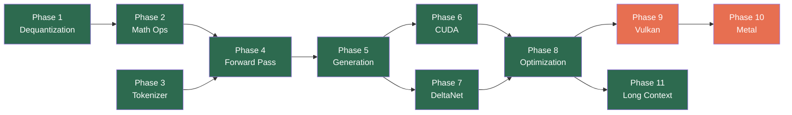

# daisi-llama

A ground-up C# reimplementation of llama.cpp targeting .NET 10. Native performance through direct hardware access — SIMD intrinsics on CPU, raw P/Invoke to CUDA/Vulkan/Metal on GPU. No managed wrapper libraries, no ONNX, no Python.

## Platform Support

| Platform | Backend | Status |
|----------|---------|--------|
| Windows x64 | CPU (AVX2/AVX-512) | Priority |
| Windows x64 | CUDA 13 (NVIDIA) | Priority |
| Linux x64 | CPU (AVX2/AVX-512) | Planned |
| Linux x64 | Vulkan (NVIDIA/AMD/Intel) | Planned |
| macOS arm64 | Metal (Apple Silicon) | Planned |
| macOS x64 | Metal (Intel/AMD) | Planned |
| iOS arm64 | Metal (XCFramework) | Planned |

## Quick Start

```bash
# Build
dotnet build

# Run tests (requires Qwen 3.5 0.8B Q8_0 in C:\GGUFS)
dotnet test

# Generate text (CPU)
dotnet run --project src/Daisi.Llama.Cli -- \
    --model C:\GGUFS\Qwen3.5-0.8B-Q8_0.gguf \
    --prompt "Hello, world"

# Generate text (CUDA GPU)
dotnet run --project src/Daisi.Llama.Cli -- \
    --model C:\GGUFS\Qwen3.5-0.8B-Q8_0.gguf \
    --prompt "Hello, world" \
    --backend cuda

# Sliding window + attention sinks (fixed memory, infinite streaming)
dotnet run --project src/Daisi.Llama.Cli -- \
    --model C:\GGUFS\Qwen3.5-0.8B-Q8_0.gguf \
    --prompt "Hello, world" \
    --attention sinks:64,4096

# Benchmark (prefill + decode timing)
dotnet run --project src/Daisi.Llama.Cli -- \
    --model C:\GGUFS\Qwen3.5-0.8B-Q8_0.gguf \
    --bench --backend cuda
```

### Test model

Tests validate against [Qwen 3.5 0.8B Q8_0](https://huggingface.co/unsloth/Qwen3.5-0.8B-GGUF). Download the GGUF file to `C:\GGUFS\Qwen3.5-0.8B-Q8_0.gguf`. Tests that require the model skip gracefully if the file is not present.

## Current Status

**End-to-end text generation on both CPU and GPU.** 136 passing tests.

### Benchmarks

Qwen 3.5 0.8B Q8_0, 256 decode tokens, FP16 KV cache. Measured on AMD Ryzen 9 9900X + NVIDIA RTX 5080.

| Backend | Attention | Prefill (tok/s) | Decode (tok/s) | KV Memory |
|---------|-----------|----------------:|---------------:|----------:|
| CPU (AVX2) | `full` | 7.9 | 5.5 | Grows with context |
| CPU (AVX2) | `window:1024` | 8.2 | 7.9 | Fixed 2 MB |
| CPU (AVX2) | `sinks:64,4096` | 7.9 | 6.9 | Fixed 8 MB |
| CUDA (RTX 5080) | `full` | 138.8 | 42.9 | Grows with context |
| CUDA (RTX 5080) | `window:1024` | 134.9 | 43.2 | Fixed 2 MB |
| CUDA (RTX 5080) | `sinks:64,4096` | 128.8 | 42.7 | Fixed 8 MB |
| CPU (AVX2) | `full --paged` | 6.8 | 6.6 | Grows on demand |
| CUDA (RTX 5080) | `full --paged` | 136.2 | 42.3 | Grows on demand |
| CUDA (RTX 5080) | `full --paged --offload-pages 2` | 129.5 | 41.4 | 2 pages VRAM + RAM |

Sliding window modes use fixed memory regardless of total tokens generated. On CPU, the smaller attention window gives a measurable decode speedup (~44% faster with `window:1024` vs `full` at 256 tokens). On GPU, decode is already compute-bound at this model size so the benefit appears at longer contexts. Paged cache adds <2% overhead vs monolithic; RAM offloading via pinned host memory adds <3%.

What works today:
- Parse any GGUF v2/v3 file (header, metadata, tensor info)
- Full quantization type support (41 GgmlType variants with block/type size calculation)
- `IComputeBackend` / `ITensor` abstraction — forward pass is backend-agnostic
- CPU backend: AVX2 SIMD matmul (fused Q8_0 dequant), multi-threaded, Q8_0/Q4_0/Q4_K dequantization
- CUDA backend: NVRTC JIT compilation, block-per-neuron matmul with warp reduction, stream-batched kernels, async D2D copy
- 13 composite GPU operations: GatedAttention, DeltaNetStep, CausalConv1d, ComputeDecayBeta, etc.
- Complete hybrid forward pass: standard gated attention (6 layers) + DeltaNet (18 layers)
- BPE tokenizer, KV cache, DeltaNet recurrent state + conv1d buffers
- Tiled/flash attention with online softmax (no shared memory limit on context length)
- FP16 KV cache (2x memory savings, default)
- Sliding window + attention sinks for fixed-memory streaming (`--attention sinks:64,4096`)
- Paged KV cache with dynamic allocation (`--paged`), RAM offloading (`--offload-pages`)
- Sampler with temperature, top-k, top-p, repetition penalty
- Memory-mapped model loading (zero intermediate byte[] copies)
- Benchmark suite with separate prefill/decode timing (`--bench`)
- CLI: `--backend cpu|cuda`, `--bench`, `--no-mmap`, `--attention`, `--paged`, `--offload-pages`, model path, prompt, sampling parameters

## Roadmap



| Phase | Name | Goal | Status |
|-------|------|------|--------|
| 0 | [GGUF Parser](#current-status) | Parse GGUF files, read metadata and tensor info | Done |
| 1 | [Dequantization](docs/roadmap/phase-01-dequantization.md) | `IComputeBackend` + CPU dequantization (Q8_0, Q4_0, Q4_K) | Done |
| 2 | [Math Ops](docs/roadmap/phase-02-math-ops.md) | CPU SIMD matmul, RMSNorm, softmax, SiLU, RoPE | Done |
| 3 | [Tokenizer](docs/roadmap/phase-03-tokenizer.md) | BPE tokenizer from GGUF metadata | Done |
| 4 | [Forward Pass](docs/roadmap/phase-04-forward-pass.md) | Model loading + hybrid forward pass (attention + DeltaNet) | Done |
| 5 | [Generation](docs/roadmap/phase-05-generation.md) | Sampling, text generation loop, CLI | Done |
| 6 | [CUDA](docs/roadmap/phase-06-cuda.md) | NVIDIA GPU backend with fused kernels | Done |
| 7 | [DeltaNet](docs/roadmap/phase-07-deltanet.md) | Qwen 3.5 hybrid DeltaNet architecture | Done (folded into Phase 4) |
| 8 | [Optimization](docs/roadmap/phase-08-optimization.md) | Mmap loading, benchmark suite, multi-threaded CPU, CUDA tuning | Done |
| 9 | [Vulkan](docs/roadmap/phase-09-vulkan.md) | Cross-platform GPU backend (Windows/Linux) | Not started |
| 10 | [Metal](docs/roadmap/phase-10-metal.md) | Apple GPU backend (macOS/iOS) | Not started |
| 11 | [Long Context](docs/roadmap/phase-11-long-context.md) | Flash attention, paged KV, RAM offload — 200K+ context on 16GB | Done (11a-11e) |

## Documentation

| Document | Description |
|----------|-------------|
| [Definitions](docs/definitions.md) | Glossary of all key terms |
| [Architecture](docs/architecture.md) | Solution structure, backend abstraction, data flow |
| [GGUF Format](docs/gguf-format.md) | Binary format deep dive with byte-level layouts |
| [Inference Pipeline](docs/inference-pipeline.md) | Complete walkthrough: tokenize → forward pass → sample |
| [CUDA Backend](docs/cuda-backend.md) | P/Invoke design, kernel compilation, fused operations |
| [DeltaNet](docs/deltanet.md) | Gated DeltaNet linear attention and hybrid architecture |
| [Long Context](docs/roadmap/phase-11-long-context.md) | Flash attention, paged KV cache, RAM offloading for 200K+ context |

## Solution Structure

```
daisi-llama/
├── src/
│   ├── Daisi.Llama/            Core library (GGUF, model, inference, tokenizer)
│   ├── Daisi.Llama.Cpu/        CPU compute backend (SIMD)
│   ├── Daisi.Llama.Cuda/       NVIDIA CUDA backend
│   ├── Daisi.Llama.Vulkan/     Vulkan compute backend
│   ├── Daisi.Llama.Metal/      Apple Metal backend
│   └── Daisi.Llama.Cli/        Command-line interface
├── tests/
│   └── Daisi.Llama.Tests/      Unit and integration tests
└── docs/                        Architecture and roadmap documentation
```

## License

MIT License. Copyright 2026 DAISI.
