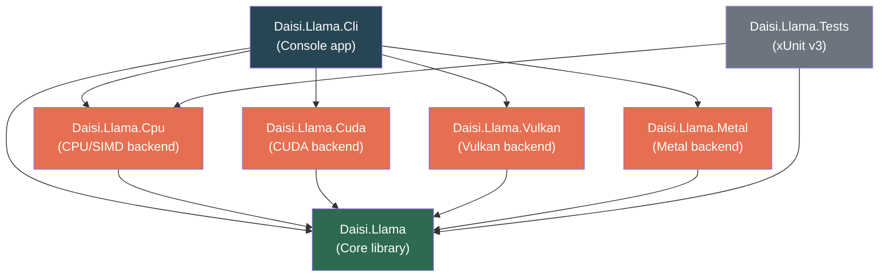
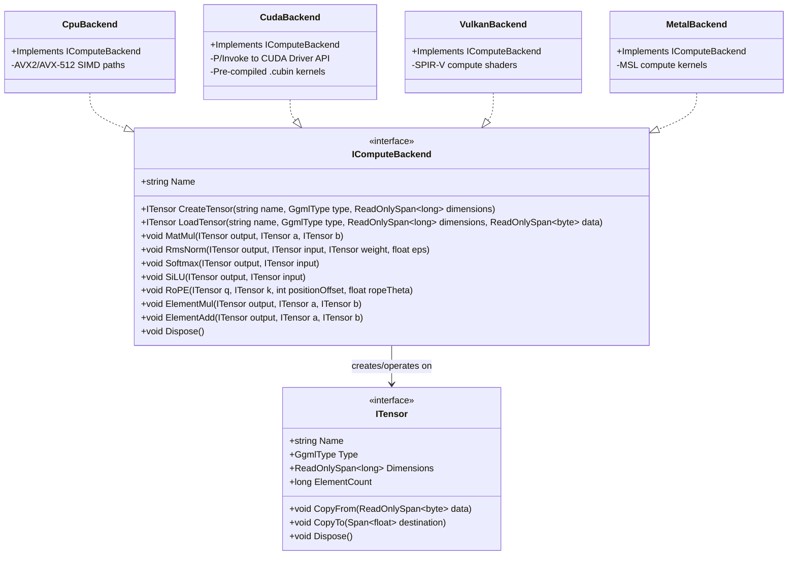
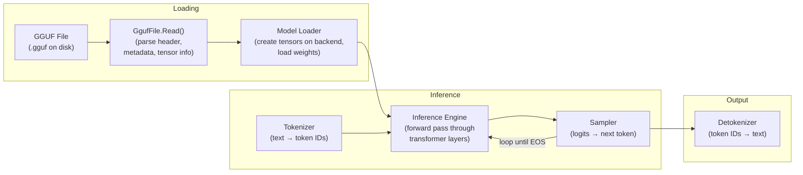
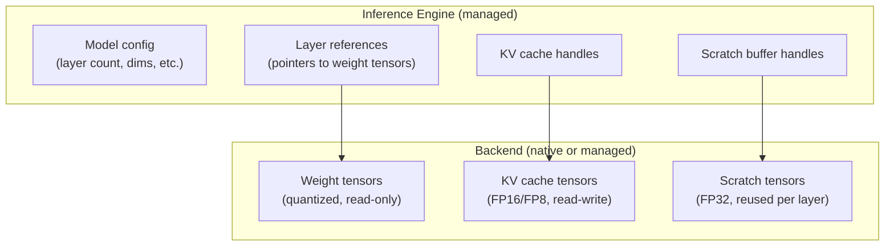
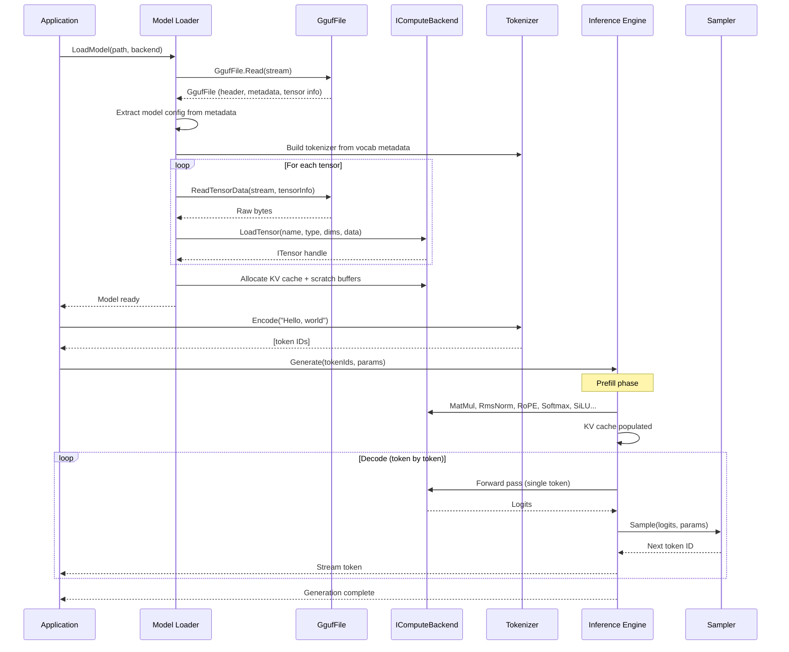

# Architecture

> High-level system design for daisi-llama.
> [Definitions](definitions.md) | [Roadmap](../README.md#roadmap)

---

## Solution Structure

daisi-llama is organized as a multi-project .NET 10 solution. The core library has zero dependencies on any backend — backends are separate assemblies loaded by the CLI or host application.

### Project responsibilities

| Project | Role |
|---------|------|
| **Daisi.Llama** | GGUF parser, model loader, tokenizer, inference engine, sampling. Defines `IComputeBackend` and `ITensor` interfaces. Contains no hardware-specific code. |
| **Daisi.Llama.Cpu** | CPU compute backend using .NET SIMD intrinsics (`Vector256<T>`, `Vector512<T>`). Implements dequantization, matmul, RMSNorm, softmax, SiLU, RoPE. |
| **Daisi.Llama.Cuda** | NVIDIA GPU backend. Raw P/Invoke to CUDA Driver API, pre-compiled .cubin kernels, fused dequant+matmul. |
| **Daisi.Llama.Vulkan** | Cross-platform GPU backend using Vulkan compute shaders (SPIR-V). Targets Windows and Linux. |
| **Daisi.Llama.Metal** | Apple GPU backend using Metal compute shaders. Targets macOS (arm64/x64) and iOS via XCFramework. |
| **Daisi.Llama.Cli** | Command-line interface. Model loading, text generation, interactive chat. Selects backend based on available hardware. |
| **Daisi.Llama.Tests** | Unit and integration tests. Uses a real Qwen 3.5 0.8B Q8_0 model for integration validation. |

---

## Compute Backend Abstraction

The core library defines interfaces that all backends implement. The inference engine works exclusively through these interfaces — it never touches hardware-specific APIs.

### Design principles

- **Backend owns tensors.** The backend allocates and manages all tensor memory. CPU tensors are managed arrays; CUDA tensors are device pointers behind `SafeHandle` wrappers. The inference engine never directly accesses tensor memory.
- **No cross-backend tensors.** A tensor created by one backend cannot be passed to another. Model loading binds to a single backend for the session.
- **Fused operations are optional.** Backends may implement fused operations (e.g., dequant+matmul) as optimizations. The inference engine calls primitive operations; the backend decides whether to fuse them internally.
- **Quantized math where possible.** Backends perform dequantization inside operations (e.g., matmul reads Q8_0 data and dequantizes on the fly) rather than dequantizing all weights upfront.

---

## Data Flow

From GGUF file on disk to generated text output:

### Step-by-step

1. **Parse** — `GgufFile.Read()` reads the binary header, all metadata KV pairs, and tensor info descriptors. Tensor data is not loaded yet.
2. **Load** — The model loader iterates tensor info, reads raw bytes from the tensor data section, and calls `backend.LoadTensor()` to allocate and populate each tensor on the target device.
3. **Tokenize** — The BPE tokenizer (vocabulary and merge rules extracted from GGUF metadata) converts input text to token IDs.
4. **Prefill** — All prompt tokens are processed in one batched forward pass, populating the KV cache.
5. **Decode loop** — Each iteration: run forward pass for the last token, sample next token from logits, append to KV cache. Repeat until EOS or max tokens.
6. **Detokenize** — Generated token IDs are converted back to text and streamed to the user.

---

## Memory Model

**Ownership rules:**

| Resource | Owner | Lifetime |
|----------|-------|----------|
| Weight tensors | Backend | Model load → model dispose |
| KV cache | Backend | Model load → model dispose (grows with context) |
| Scratch buffers | Backend | Allocated at model load, reused every forward pass |
| Model config | Inference engine | Extracted from GGUF metadata at load time |
| Token buffers | Inference engine | Per-generation, managed arrays |

---

## Complete Generation Request

End-to-end sequence for a text generation call:

