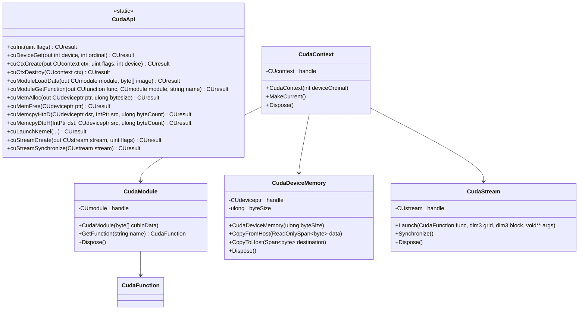
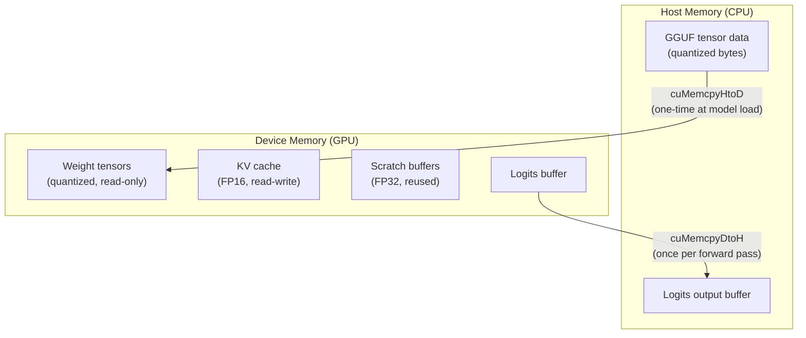
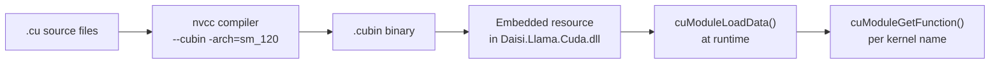
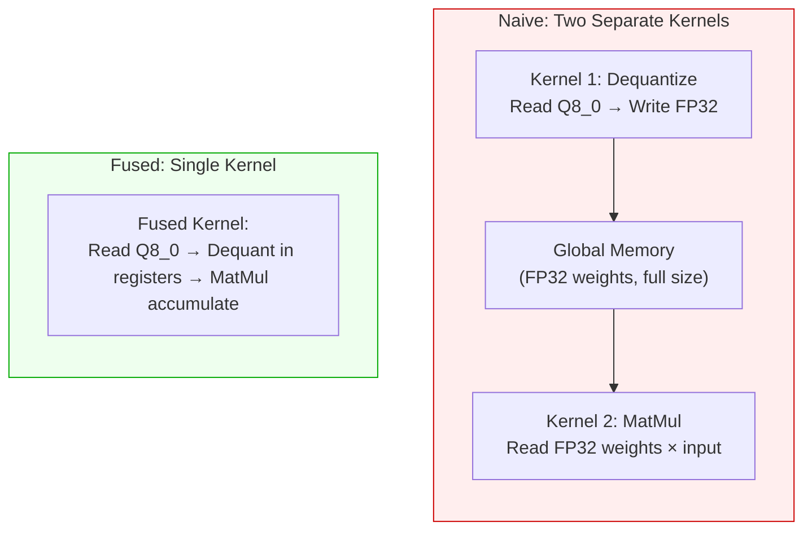
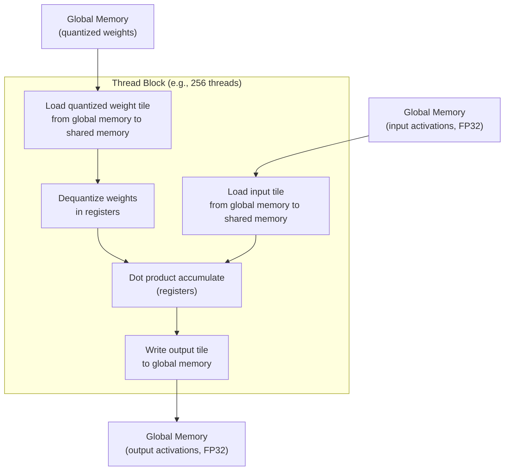
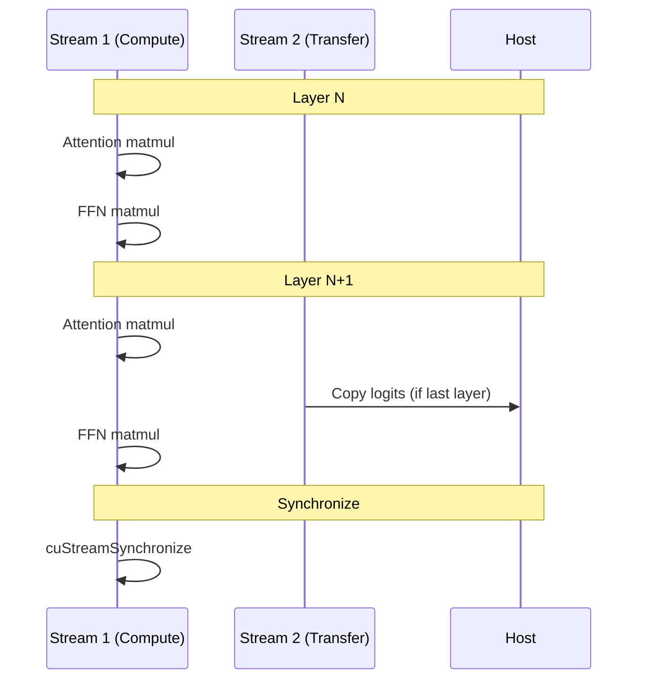
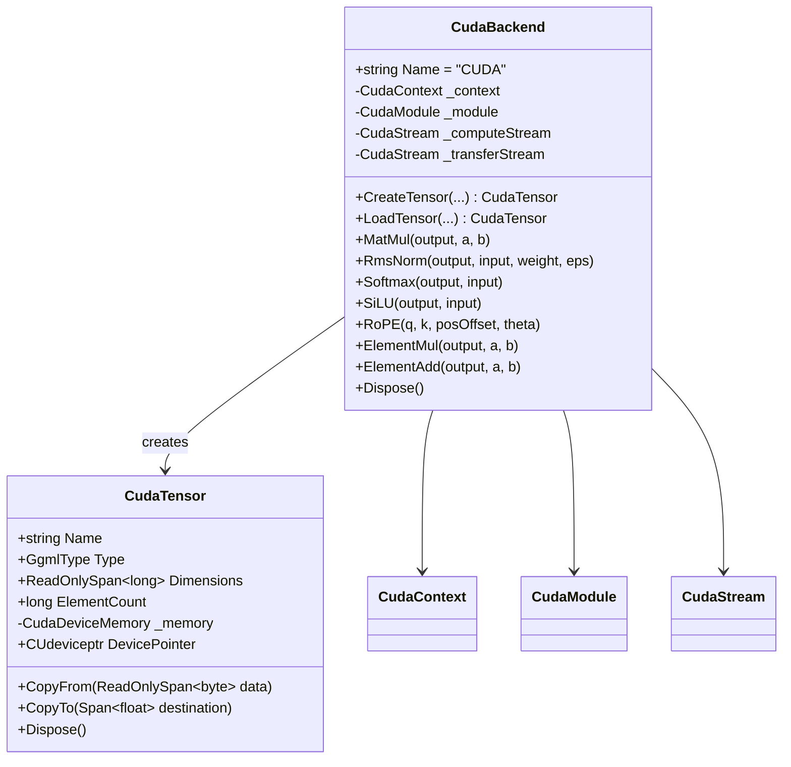

# CUDA Backend

> Architecture and design for the NVIDIA CUDA compute backend.
> [Definitions](definitions.md) | [Architecture](architecture.md) | [Phase 6 Roadmap](roadmap/phase-06-cuda.md)

---

## Overview

The CUDA backend provides GPU-accelerated inference on NVIDIA GPUs using CUDA 13. Unlike most .NET CUDA libraries, daisi-llama uses **raw P/Invoke** to the CUDA Driver API — no managed wrappers, no CUDA Runtime API, no cuDNN. This gives full control over memory management, kernel loading, and stream orchestration.

Key design choices:
- **CUDA Driver API** (not Runtime API) — explicit context management, direct kernel loading
- **Pre-compiled .cubin kernels** — no JIT compilation at startup, deterministic performance
- **SafeHandle wrappers** — managed RAII for all CUDA resources (contexts, modules, streams, device memory)
- **Fused kernels** — dequantize and compute in a single kernel to minimize memory traffic

---

## P/Invoke Layer

### CUDA Driver API Bindings



### SafeHandle Pattern

Every CUDA resource is wrapped in a `SafeHandle`-derived class that guarantees cleanup:

```csharp
// Conceptual pattern — actual implementation will follow this structure
class CudaDeviceMemoryHandle : SafeHandleZeroOrMinusOneIsInvalid
{
    protected override bool ReleaseHandle()
    {
        return CudaApi.cuMemFree(handle) == CUresult.CUDA_SUCCESS;
    }
}
```

This ensures GPU memory is freed even if exceptions occur or the GC collects the object.

---

## Memory Management



### Transfer strategy

| Data | Direction | When | Frequency |
|------|-----------|------|-----------|
| Model weights | Host → Device | Model load | Once |
| KV cache | Device only | Inference | Never transferred |
| Scratch buffers | Device only | Inference | Never transferred |
| Input token IDs | Host → Device | Each generate call | Once per call |
| Logits | Device → Host | Each forward pass | Once per decode step |

**Key principle:** Minimize host-device transfers. Weights are uploaded once. All intermediate computation stays on device. Only the final logits vector (vocab_size floats) is copied back per step.

---

## Kernel Compilation and Loading

### Build pipeline



### Why pre-compiled cubin?

| Approach | Startup time | Runtime overhead | Deployment |
|----------|-------------|------------------|------------|
| **PTX (JIT)** | Slow (compile on first run) | None after compile | Single binary, any GPU arch |
| **cubin (AOT)** | Instant (no compilation) | None | Must ship per target arch |
| **Fat binary** | Instant | None | Larger file, multiple archs |

daisi-llama ships pre-compiled cubin for target architectures (sm_120 for Blackwell, sm_89 for Ada Lovelace, sm_86 for Ampere). A fat binary approach may be used to bundle multiple architectures.

### Target architectures

| sm_arch | GPU Family | Examples |
|---------|-----------|----------|
| sm_86 | Ampere | RTX 3060-3090, A100 |
| sm_89 | Ada Lovelace | RTX 4060-4090, L40 |
| sm_100 | Blackwell | RTX 5060-5090, B200 |
| sm_120 | Blackwell Ultra | B300 |

---

## Fused Dequant + MatMul Kernel

The most critical optimization: combining dequantization and matrix multiplication into a single kernel pass.

### Why fusion matters



**Naive approach:** Dequantize all weights to FP32 in global memory (4× the quantized size), then read them again for matmul. Two full passes over the weight data.

**Fused approach:** Each thread block loads a tile of quantized weights, dequantizes into registers or shared memory, and immediately uses them for the matmul dot product. Weight data is read exactly once from global memory.

### Fused kernel data flow



### Kernel launch configuration

For a matmul of `[M × K] × [K × N] → [M × N]`:

| Parameter | Value | Rationale |
|-----------|-------|-----------|
| **Block size** | 256 threads | Good occupancy on most architectures |
| **Grid X** | `ceil(N / tile_N)` | One block column per output tile column |
| **Grid Y** | `ceil(M / tile_M)` | One block row per output tile row |
| **Shared memory** | `tile_K × (tile_M + tile_N) × sizeof(float)` | Tiles for both operands |
| **Tile size** | 128×128 or 64×64 | Tuned per architecture |

---

## Multi-Stream Pipeline

Multiple CUDA streams enable overlapping computation with memory transfers:



In practice, the main benefit of multi-stream for inference is overlapping the final logits D2H transfer with the last layer's computation. The weight data is already on device, so there's no upload to overlap during inference.

---

## CudaBackend Implementation



### Kernel inventory

| Kernel name | Operation | Input types | Notes |
|-------------|-----------|-------------|-------|
| `dequant_matmul_q8_0` | Fused dequant + matmul | Q8_0 × FP32 | Primary inference kernel |
| `dequant_matmul_q4_0` | Fused dequant + matmul | Q4_0 × FP32 | For 4-bit models |
| `dequant_matmul_q4_k` | Fused dequant + matmul | Q4_K × FP32 | For K-quant models |
| `rms_norm` | RMSNorm | FP32 | Block-level reduction |
| `softmax` | Softmax | FP32 | Numerically stable (max subtraction) |
| `silu` | SiLU activation | FP32 | Element-wise |
| `rope` | RoPE encoding | FP32 | Paired dimension rotation |
| `element_mul` | Element-wise multiply | FP32 | For SwiGLU gate |
| `element_add` | Element-wise add | FP32 | For residual connections |
