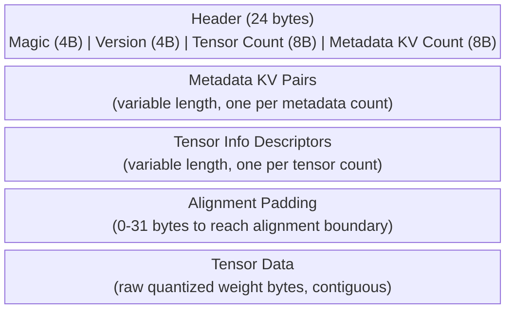
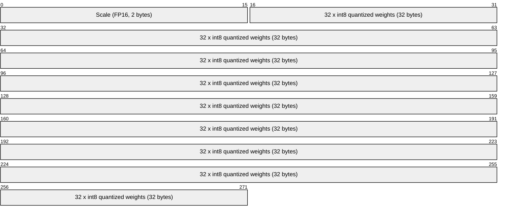
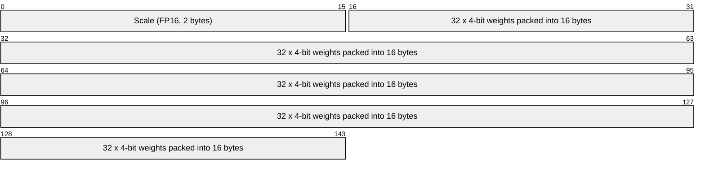
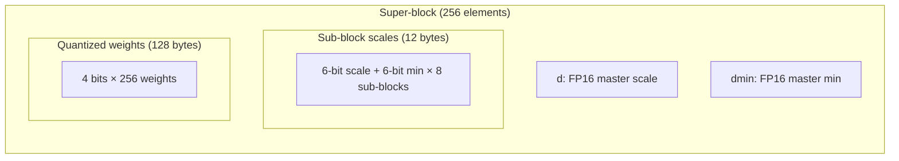
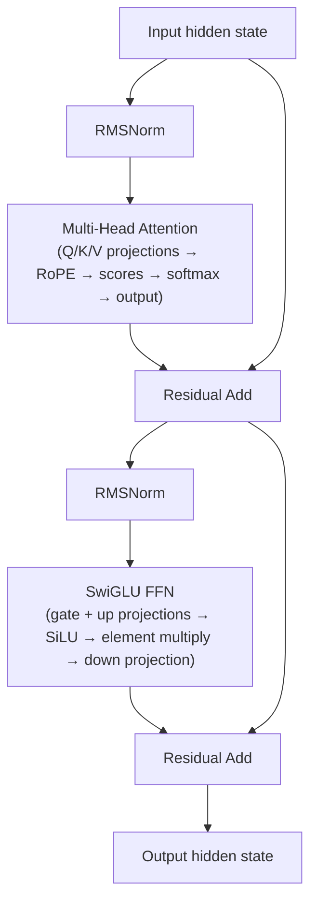
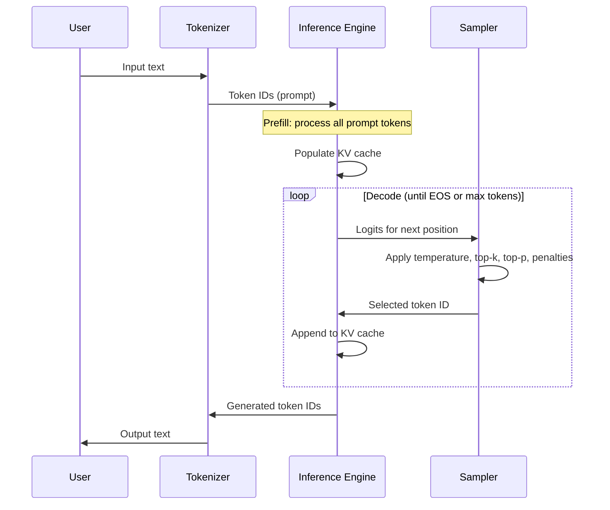

# Definitions

> Glossary of terms used throughout the daisi-llama documentation.
> Linked from every doc page for quick reference.

---

## GGUF Format

| Term | Summary |
|------|---------|
| **GGUF** | **G**GPT **U**nified **F**ormat — the binary file format for storing quantized LLM weights and metadata. Successor to GGML and GGJT. |
| **Magic number** | The first 4 bytes of every GGUF file: `0x46554747` (ASCII `GGUF`). Used to validate the file before parsing. |
| **Metadata KV** | Key-value pairs stored in the GGUF header. Keys are UTF-8 strings; values are one of 13 typed variants (uint8 through float64, plus string, bool, and array). Carry model config like architecture name, context length, and vocab size. |
| **Tensor info** | A descriptor for each weight tensor: name, number of dimensions, dimension sizes, quantization type, and byte offset into the tensor data section. |
| **Alignment** | GGUF requires the tensor data section to start at a byte offset that is a multiple of the alignment value (default 32). Individual tensors are also aligned. Stored in `general.alignment` metadata. |

### GGUF binary layout

---

## Quantization

| Term | Summary |
|------|---------|
| **GgmlType** | Enum identifying a tensor's numeric format. 41 variants ranging from full-precision (F32, F16) to aggressively quantized (Q2_K, IQ1_S). |
| **Block size** | Number of elements (weights) packed into one quantization block. Q8_0 uses 32 elements per block; Q4_0 also uses 32; K-quants vary. |
| **Type size** | Number of bytes consumed by one quantization block. Q8_0 = 34 bytes (32 quantized bytes + 2-byte scale). Q4_0 = 18 bytes. |
| **Q4_0** | 4-bit quantization. Each block holds 32 weights in 16 bytes (4 bits each) plus a 2-byte FP16 scale factor. 18 bytes per block. |
| **Q8_0** | 8-bit quantization. Each block holds 32 weights in 32 bytes (8 bits each) plus a 2-byte FP16 scale factor. 34 bytes per block. |
| **Q4_K** | K-quant 4-bit format. Uses a super-block of 256 elements with nested sub-blocks, two FP16 scales (d, dmin), and per-sub-block 6-bit scales/mins. More accurate than Q4_0 at similar size. |
| **K-quants** | Family of quantization formats (Q2_K through Q8_K) using nested block structures with per-sub-block scaling for better accuracy than legacy quants. |
| **IQ-quants** | Importance-weighted quantization formats (IQ1_S through IQ4_XS). Use lookup tables and importance matrices for extremely low bit-widths with minimal quality loss. |

### Quantization block structure — Q8_0

> **Total: 34 bytes per block of 32 elements.**
> To dequantize: `weight[i] = scale * quant[i]`

### Quantization block structure — Q4_0

> **Total: 18 bytes per block of 32 elements.**
> Each byte holds two 4-bit weights. Weights are unsigned [0..15], re-centered by subtracting 8.
> To dequantize: `weight[i] = scale * (nibble[i] - 8)`

### Quantization block structure — Q4_K

> **Total: 144 bytes per super-block of 256 elements.**
> Each sub-block (32 elements) has its own scale and minimum, derived from the 6-bit values multiplied by the master d/dmin.

---

## Model Architecture

| Term | Summary |
|------|---------|
| **Transformer** | The dominant neural network architecture for language models. Processes tokens through repeated layers of attention and feed-forward networks. |
| **Attention head** | One parallel stream within the multi-head attention mechanism. Each head independently computes query-key-value attention over the input, then results are concatenated. |
| **KV cache** | Stores previously computed key and value tensors so they don't need recomputation during autoregressive generation. Grows by one entry per token generated. |
| **RMSNorm** | Root Mean Square Layer Normalization. Normalizes activations by dividing by the RMS of the vector, then scaling by a learned weight. Simpler and faster than LayerNorm (no mean subtraction or bias). |
| **RoPE** | Rotary Position Embedding. Encodes token position by rotating query and key vectors in 2D subspaces using sinusoidal frequencies. Enables relative position awareness without explicit position tokens. |
| **SiLU** | Sigmoid Linear Unit activation: `SiLU(x) = x * sigmoid(x)`. Also called Swish. Used in the FFN gate projection. |
| **FFN** | Feed-Forward Network. The non-attention computation in each transformer layer. Takes the attention output and applies two or three linear projections with a nonlinearity. |
| **SwiGLU** | A gated FFN variant: `SwiGLU(x) = SiLU(W_gate * x) ⊙ (W_up * x)`, then projected down by W_down. Used by Qwen, LLaMA, and most modern LLMs. More expressive than a plain FFN. |
| **DeltaNet** | A linear attention variant that maintains a recurrent state matrix updated via delta rules. Replaces standard attention in select layers for O(1) per-token inference cost. |
| **Gated Linear Attention** | Umbrella term for attention mechanisms that use gating and linear (non-softmax) attention. DeltaNet is one instance. Enables constant-memory inference for long contexts. |

### Transformer layer structure

---

## Inference

| Term | Summary |
|------|---------|
| **Forward pass** | One complete evaluation of the model: input tokens in, logits out. During generation, each forward pass produces logits for the next token. |
| **Prefill** | Processing all prompt tokens in a single batched forward pass. Populates the KV cache for every prompt position simultaneously. Compute-bound (large matrix multiplies). |
| **Decode** | Generating one token at a time after prefill. Each step feeds the last generated token, appends to the KV cache, and produces logits for the next position. Memory-bandwidth-bound (reading the full KV cache for one token). |
| **Logits** | Raw unnormalized scores output by the model's final linear layer, one per vocabulary token. Converted to probabilities via softmax before sampling. |
| **Sampling** | Selecting the next token from the logit distribution. Strategies include greedy (argmax), temperature scaling, top-k filtering, top-p (nucleus) filtering, and Mirostat. |
| **Temperature** | Scales logits before softmax: `logits / temperature`. Lower values (e.g. 0.2) make the distribution peakier (more deterministic); higher values (e.g. 1.5) flatten it (more random). |
| **Top-k** | Keep only the k highest-probability tokens, zero out the rest, then renormalize. Limits the candidate set to the most likely options. |
| **Top-p (nucleus)** | Sort tokens by probability descending, keep the smallest set whose cumulative probability exceeds p, zero out the rest. Adapts candidate set size to the distribution shape. |
| **Repetition penalty** | Reduces the probability of tokens that have already appeared in the context. Divides logits of seen tokens by a penalty factor (> 1.0) to discourage repetition. |
| **Mirostat** | An adaptive sampling algorithm that targets a specific perplexity (surprise level) by dynamically adjusting the sampling threshold. Produces more consistent output quality than fixed top-k/top-p. |

### Generation loop

---

## Compute

| Term | Summary |
|------|---------|
| **Backend** | A compute provider that implements tensor operations (matmul, element-wise ops, etc.) on specific hardware. daisi-llama defines an `IComputeBackend` interface with CPU, CUDA, Vulkan, and Metal implementations. |
| **Tensor** | A multidimensional array of numbers. Model weights and intermediate activations are tensors. Each backend manages tensor memory and operations through `ITensor`. |
| **SIMD** | Single Instruction, Multiple Data. CPU instructions that operate on multiple values simultaneously. daisi-llama's CPU backend uses .NET's `Vector256<T>` / `Vector512<T>` for AVX2/AVX-512. |
| **AVX2** | Advanced Vector Extensions 2. Processes 256 bits (8 floats) per instruction. Available on most x64 CPUs since ~2013. The minimum SIMD tier for daisi-llama's CPU backend. |
| **AVX-512** | 512-bit SIMD. Processes 16 floats per instruction. Available on Intel server CPUs and recent AMD Zen 4/5. Used when available for ~2x throughput over AVX2. |
| **CUDA** | NVIDIA's GPU compute platform. daisi-llama uses raw P/Invoke calls to the CUDA Driver API with pre-compiled .cubin kernels — no managed wrapper libraries. |
| **Vulkan** | Cross-platform GPU compute API. Uses SPIR-V compute shaders. Targets Windows and Linux GPUs (NVIDIA, AMD, Intel). |
| **Metal** | Apple's GPU compute API. Uses Metal Shading Language compute kernels. Targets macOS (arm64, x64) and iOS. |
| **Kernel** | A function that runs on the GPU. Each kernel is launched with a grid of thread blocks that execute in parallel. CUDA kernels are written in CUDA C++; Vulkan uses GLSL compute shaders; Metal uses MSL. |
| **Fused kernel** | A single GPU kernel that combines multiple operations (e.g., dequantize + matrix multiply) to avoid intermediate memory reads/writes. Critical for performance. |
| **P/Invoke** | Platform Invocation Services. .NET mechanism for calling native C/C++ functions from managed code. daisi-llama uses P/Invoke to call CUDA, Vulkan, and Metal APIs directly. |
| **cubin** | Compiled CUDA binary. Pre-compiled from .cu source for specific GPU architectures (e.g., sm_120 for Blackwell). Loaded at runtime via `cuModuleLoadData`. |
| **PTX** | Parallel Thread Execution. NVIDIA's intermediate representation for GPU code. Can be JIT-compiled to cubin at runtime, but daisi-llama prefers pre-compiled cubin for faster startup. |

---

## Performance

| Term | Summary |
|------|---------|
| **Tokens/sec** | Primary throughput metric. Measured separately for prefill (tokens processed per second) and decode (tokens generated per second). |
| **TFLOPS** | Tera floating-point operations per second. Measures raw compute utilization. Useful for comparing against GPU theoretical peak. |
| **Memory bandwidth** | Rate of data transfer between memory and compute units (GB/s). Decode performance is typically bottlenecked by memory bandwidth since it reads the entire KV cache per token. |
| **Occupancy** | Fraction of a GPU's maximum concurrent threads that are actually active. Higher occupancy generally means better latency hiding, but not always higher throughput. |
| **KV cache quantization** | Storing the KV cache in a lower-precision format (e.g., FP8 or Q8_0 instead of FP16) to reduce memory usage and bandwidth requirements during decode. Enables longer context lengths. |
