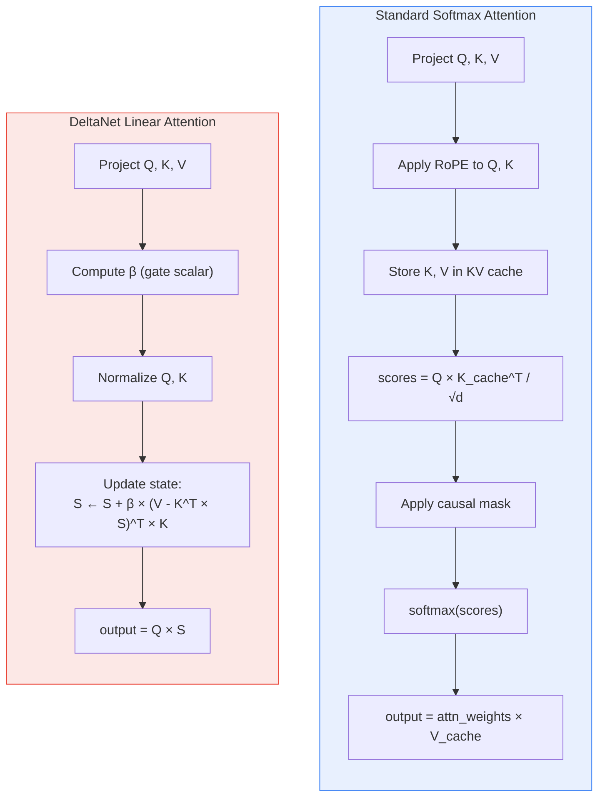
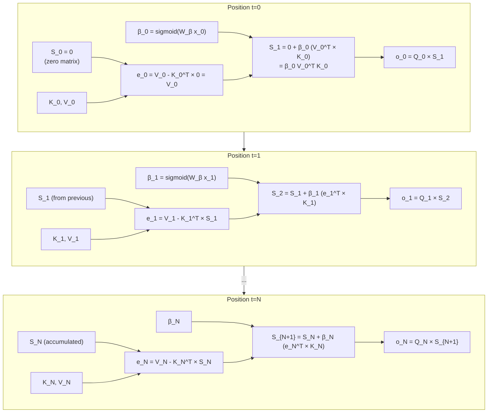
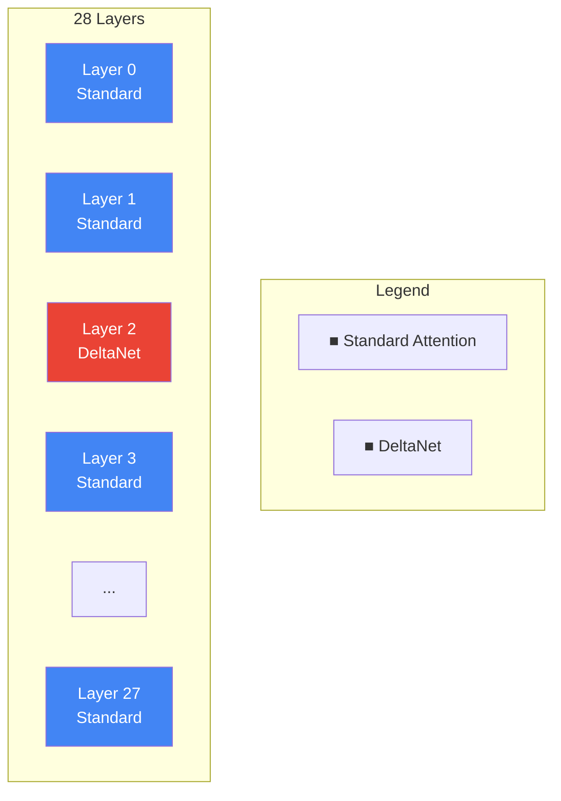
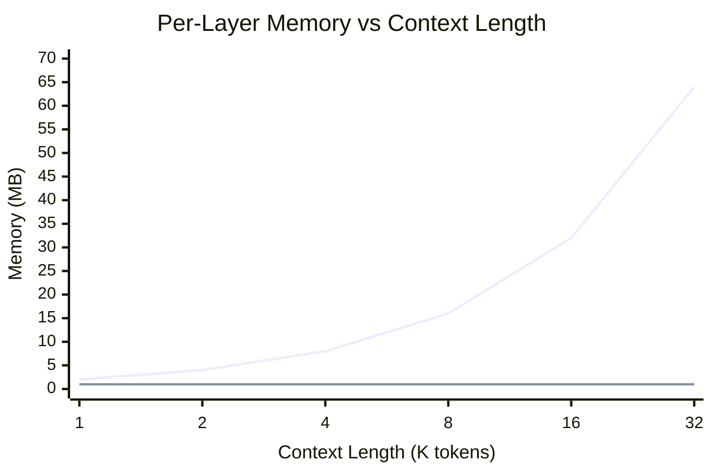
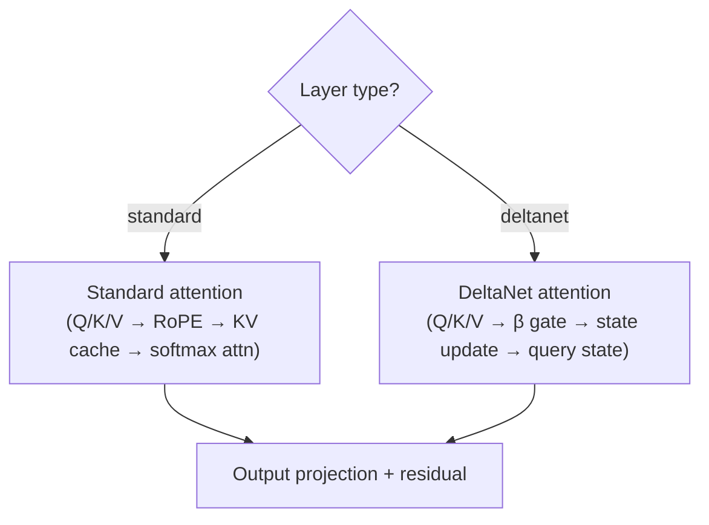

# DeltaNet & Hybrid Architecture

> Gated DeltaNet linear attention as used in Qwen 3.5's hybrid architecture.
> [Definitions](definitions.md) | [Architecture](architecture.md) | [Phase 7 Roadmap](roadmap/phase-07-deltanet.md)

---

## Overview

Qwen 3.5 uses a **hybrid** architecture: most layers use standard softmax attention, but select layers use **Gated DeltaNet** — a linear attention variant with O(1) per-token memory and compute during decode. This enables efficient long-context inference without the quadratic KV cache growth of full attention.

DeltaNet is implemented as a drop-in replacement for the standard attention block. The rest of the layer (RMSNorm, SwiGLU FFN, residuals) is identical.

---

## Standard Attention vs DeltaNet



### Key differences

| Property | Standard Attention | DeltaNet |
|----------|-------------------|----------|
| **Per-token decode cost** | O(context_length) | O(1) |
| **Memory per layer** | KV cache grows with context | Fixed-size state matrix |
| **Training** | Straightforward backprop | Requires delta rule update |
| **Quality** | Best for precise retrieval | Better for smooth reasoning |
| **Causal masking** | Explicit mask matrix | Inherent (recurrent update) |
| **Position encoding** | RoPE (sinusoidal rotation) | None needed (recurrent) |

---

## DeltaNet State Update

DeltaNet maintains a **state matrix** `S` of shape `[d_head × d_head]` per head per layer. This replaces the KV cache for that layer.

### Update equation

At each position t:

```
β_t = sigmoid(W_β × x_t)                    # gating scalar
e_t = V_t - K_t^T × S_{t-1}                 # error: what V should be minus what S predicts
S_t = S_{t-1} + β_t × (e_t^T × K_t)         # delta update to state
o_t = Q_t × S_t                              # output query against updated state
```

### Step-by-step state evolution



### Intuition

- The state `S` acts as an **associative memory** that maps keys to values
- The **delta update** adjusts S to better predict V from K — it's an online learning rule
- The **gate β** controls how much each position updates the memory (higher β = stronger write)
- The **error term** `e_t = V_t - K_t^T S` measures how well the current state predicts the desired value — the update corrects this error
- During decode, each step is **O(d_head²)** regardless of context length

---

## Qwen 3.5 Layer Schedule

Qwen 3.5 0.8B has 28 transformer layers. The model uses a **hybrid schedule** where specific layers use DeltaNet and the rest use standard attention.



> **Note:** The exact layer schedule (which layers are DeltaNet vs standard) is specified in the model's GGUF metadata. The implementation reads this schedule dynamically rather than hardcoding it.

The hybrid approach gets the best of both worlds:
- **Standard attention layers** provide precise token-level retrieval (good for factual recall, copying)
- **DeltaNet layers** provide efficient long-range reasoning (good for summarization, sustained context)

---

## Memory Comparison

### Per-layer memory during decode

| Component | Standard Attention | DeltaNet |
|-----------|-------------------|----------|
| **State** | KV cache: `2 × seq_len × kv_heads × head_dim × sizeof(dtype)` | State matrix: `heads × head_dim × head_dim × sizeof(float)` |
| **At 1K context** (FP16) | 2 × 1024 × 8 × 64 × 2 = **2 MB** | 16 × 64 × 64 × 4 = **1 MB** |
| **At 8K context** (FP16) | 2 × 8192 × 8 × 64 × 2 = **16 MB** | **1 MB** (constant) |
| **At 32K context** (FP16) | 2 × 32768 × 8 × 64 × 2 = **64 MB** | **1 MB** (constant) |
| **Growth** | Linear with context length | **Constant** |



This is why the hybrid approach is powerful at long contexts: DeltaNet layers contribute zero KV cache growth, dramatically reducing total memory for a 28-layer model where (for example) 8 layers use DeltaNet.

---

## Implementation Approach

### Weight tensors for DeltaNet layers

DeltaNet layers have different weight tensors than standard attention layers:

| Standard Attention | DeltaNet |
|-------------------|----------|
| `attn_q.weight` | `attn_q.weight` |
| `attn_k.weight` | `attn_k.weight` |
| `attn_v.weight` | `attn_v.weight` |
| `attn_output.weight` | `attn_output.weight` |
| — | `attn_beta.weight` (gate projection) |
| `attn_norm.weight` | `attn_norm.weight` |

### Backend operations needed

DeltaNet requires these additional backend operations beyond standard attention:

| Operation | Description | Shape |
|-----------|-------------|-------|
| **OuterProduct** | `e^T × K` to form the state update | `[d_head] × [d_head] → [d_head × d_head]` |
| **MatVecBatched** | `Q × S` for output, batched over heads | `[d_head] × [d_head × d_head] → [d_head]` per head |
| **Sigmoid** | For computing β gate | Element-wise |
| **StateUpdate** | Fused `S += β × (e^T × K)` | In-place on state matrix |

These may be added to `IComputeBackend` or implemented as a DeltaNet-specific extension.

### Forward pass integration



The inference engine checks each layer's type (from model metadata) and dispatches to the appropriate attention implementation. Everything else in the layer (norms, FFN, residuals) is shared.
