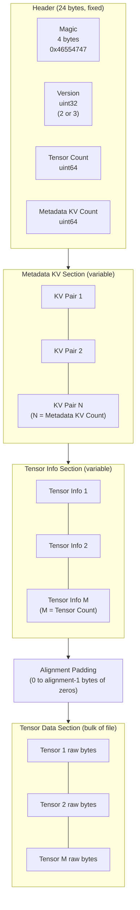
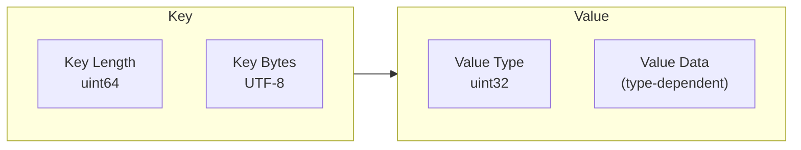
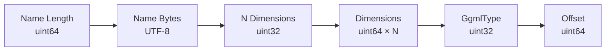
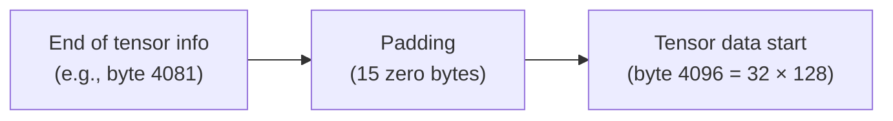

# GGUF Format Deep Dive

> Complete reference for the GGUF binary format as implemented in daisi-llama.
> [Definitions](definitions.md) | [Architecture](architecture.md) | [Roadmap](../README.md#roadmap)

---

## Overview

GGUF (GGPT Unified Format) is a binary format for storing quantized large language model weights alongside their metadata. It replaced the earlier GGML and GGJT formats. daisi-llama supports GGUF versions 2 and 3.

Key properties:
- **Self-describing** — All model configuration (architecture, dimensions, vocab) is embedded as metadata KV pairs
- **Little-endian** — All multi-byte values are stored little-endian
- **Alignment-aware** — Tensor data section is aligned to configurable boundaries (default 32 bytes)
- **Lazy-loadable** — Header and metadata can be read without loading the (large) tensor data section

---

## Complete Binary Layout



---

## Header Structure

The header is exactly 24 bytes:

| Offset | Size | Type | Field | Description |
|--------|------|------|-------|-------------|
| 0 | 4 | uint32 | Magic | Must be `0x46554747` (ASCII `GGUF`) |
| 4 | 4 | uint32 | Version | File format version (2 or 3 supported) |
| 8 | 8 | uint64 | Tensor Count | Number of tensor info descriptors that follow |
| 16 | 8 | uint64 | Metadata KV Count | Number of metadata KV pairs that follow |

**Validation in daisi-llama:**
- Magic must match exactly or `InvalidDataException` is thrown
- Version must be 2 or 3; version 1 and 4+ throw `NotSupportedException`

---

## Metadata KV Encoding

Each metadata KV pair is encoded as:



### Value types

| Type ID | Name | Encoding |
|---------|------|----------|
| 0 | Uint8 | 1 byte |
| 1 | Int8 | 1 byte |
| 2 | Uint16 | 2 bytes LE |
| 3 | Int16 | 2 bytes LE |
| 4 | Uint32 | 4 bytes LE |
| 5 | Int32 | 4 bytes LE |
| 6 | Float32 | 4 bytes LE (IEEE 754) |
| 7 | Bool | 1 byte (0 = false, nonzero = true) |
| 8 | String | uint64 length + UTF-8 bytes |
| 9 | Array | uint32 element type + uint64 count + N encoded elements |
| 10 | Uint64 | 8 bytes LE |
| 11 | Int64 | 8 bytes LE |
| 12 | Float64 | 8 bytes LE (IEEE 754) |

**Note:** In GGUF v2+, all string lengths use uint64 (not uint32 as in v1). This is important for compatibility — daisi-llama reads string lengths as 8 bytes.

### Common metadata keys

| Key | Type | Example | Purpose |
|-----|------|---------|---------|
| `general.architecture` | String | `"qwen3"` | Model architecture family |
| `general.name` | String | `"Qwen3.5-0.8B"` | Human-readable model name |
| `general.alignment` | Uint32 | `32` | Tensor data alignment in bytes |
| `{arch}.context_length` | Uint32 | `32768` | Maximum context window |
| `{arch}.embedding_length` | Uint32 | `1024` | Hidden dimension size |
| `{arch}.block_count` | Uint32 | `28` | Number of transformer layers |
| `{arch}.attention.head_count` | Uint32 | `16` | Number of attention heads |
| `{arch}.attention.head_count_kv` | Uint32 | `8` | Number of KV heads (GQA) |
| `{arch}.rope.freq_base` | Float32 | `1000000.0` | RoPE frequency base (theta) |
| `tokenizer.ggml.model` | String | `"gpt2"` | Tokenizer type (BPE variant) |
| `tokenizer.ggml.tokens` | Array[String] | `["<|endoftext|>", ...]` | Vocabulary tokens |
| `tokenizer.ggml.merges` | Array[String] | `["a b", ...]` | BPE merge rules |

---

## Tensor Info Encoding

Each tensor info descriptor is encoded as:



| Field | Type | Description |
|-------|------|-------------|
| Name length | uint64 | Length of tensor name in bytes |
| Name | UTF-8 bytes | Tensor name (e.g., `blk.0.attn_q.weight`) |
| N dimensions | uint32 | Number of dimensions (1-4 typically) |
| Dimensions | uint64 × N | Size of each dimension |
| Type | uint32 | GgmlType enum value |
| Offset | uint64 | Byte offset from start of tensor data section |

**Computed properties (in daisi-llama):**
- `ElementCount` = product of all dimensions
- `ByteSize` = `GgmlTypeInfo.ByteSize(type, elementCount)` = `(elementCount / blockSize) * typeSize`

### Tensor naming convention

Tensors follow a hierarchical naming scheme:

```
token_embd.weight              — Token embedding matrix
blk.{N}.attn_q.weight         — Layer N query projection
blk.{N}.attn_k.weight         — Layer N key projection
blk.{N}.attn_v.weight         — Layer N value projection
blk.{N}.attn_output.weight    — Layer N attention output projection
blk.{N}.attn_norm.weight      — Layer N pre-attention RMSNorm
blk.{N}.ffn_gate.weight       — Layer N SwiGLU gate projection
blk.{N}.ffn_up.weight         — Layer N SwiGLU up projection
blk.{N}.ffn_down.weight       — Layer N SwiGLU down projection
blk.{N}.ffn_norm.weight       — Layer N pre-FFN RMSNorm
output_norm.weight             — Final RMSNorm
output.weight                  — Language model head (logit projection)
```

---

## Alignment and Padding

The tensor data section must start at an aligned offset:

```
tensor_data_offset = align_up(end_of_tensor_info_section, alignment)
```

Where `alignment` is read from the `general.alignment` metadata key (default: 32).



Individual tensor offsets within the tensor data section are relative to the section start:

```
absolute_tensor_offset = tensor_data_offset + tensor_info.offset
```

daisi-llama computes this in `GgufFile.Read()` and uses it in `ReadTensorData()` to seek directly to any tensor's data on demand.

---

## Dequantization Block Layouts

### Q8_0 — 8-bit quantization

34 bytes per block of 32 elements.

```
┌─────────────────────┬────────────────────────────────────────┐
│   Scale (FP16)      │     32 × int8 quantized weights       │
│     2 bytes         │            32 bytes                    │
└─────────────────────┴────────────────────────────────────────┘
         ↓                          ↓
     half → float              sbyte → float
         ↓                          ↓
         └──────── weight[i] = scale × quant[i] ───────────────
```

**Dequantization (C# pseudocode):**
```csharp
float scale = (float)BitConverter.ToHalf(block, 0);
for (int i = 0; i < 32; i++)
    output[i] = scale * (sbyte)block[2 + i];
```

### Q4_0 — 4-bit quantization

18 bytes per block of 32 elements.

```
┌─────────────────────┬────────────────────────────────────────┐
│   Scale (FP16)      │     16 bytes (32 × 4-bit nibbles)     │
│     2 bytes         │     low nibble = even index            │
│                     │     high nibble = odd index            │
└─────────────────────┴────────────────────────────────────────┘
         ↓                          ↓
     half → float            byte → two nibbles (0..15)
         ↓                          ↓
         └──── weight[i] = scale × (nibble[i] - 8) ───────────
```

**Dequantization (C# pseudocode):**
```csharp
float scale = (float)BitConverter.ToHalf(block, 0);
for (int i = 0; i < 16; i++)
{
    byte packed = block[2 + i];
    int lo = (packed & 0x0F) - 8;
    int hi = (packed >> 4) - 8;
    output[2 * i]     = scale * lo;
    output[2 * i + 1] = scale * hi;
}
```

### Q4_K — K-quant 4-bit

144 bytes per super-block of 256 elements (8 sub-blocks of 32).

```
┌──────────┬──────────┬─────────────────────┬──────────────────────────┐
│ d (FP16) │dmin(FP16)│  Scales/Mins        │  Quantized weights       │
│  2 bytes │  2 bytes │  12 bytes            │  128 bytes               │
│          │          │  (8 × 6-bit scale    │  (256 × 4-bit nibbles)   │
│          │          │   + 8 × 6-bit min)   │                          │
└──────────┴──────────┴─────────────────────┴──────────────────────────┘
```

**Dequantization per sub-block `j` (0..7):**
```csharp
float sub_scale = d * scales[j];
float sub_min   = dmin * mins[j];
for (int i = 0; i < 32; i++)
    output[j * 32 + i] = sub_scale * nibble[j * 32 + i] - sub_min;
```

The 6-bit scales and mins are packed into the 12-byte scales section using a non-trivial bit layout (lower 4 bits of each scale are in the first 8 bytes; upper 2 bits are packed into the remaining 4 bytes).

---

## Type Size Reference

| GgmlType | Block Size (elements) | Type Size (bytes) | Bits/Weight |
|----------|----------------------|-------------------|-------------|
| F32 | 1 | 4 | 32.0 |
| F16 | 1 | 2 | 16.0 |
| Q8_0 | 32 | 34 | 8.5 |
| Q4_0 | 32 | 18 | 4.5 |
| Q4_1 | 32 | 20 | 5.0 |
| Q5_0 | 32 | 22 | 5.5 |
| Q5_1 | 32 | 24 | 6.0 |
| Q4_K | 256 | 144 | 4.5 |
| Q5_K | 256 | 176 | 5.5 |
| Q6_K | 256 | 210 | 6.5625 |
| Q2_K | 256 | 84 | 2.625 |
| Q3_K | 256 | 110 | 3.4375 |
