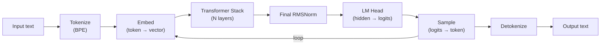
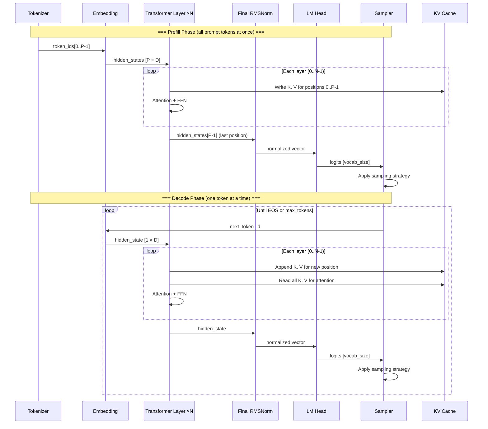
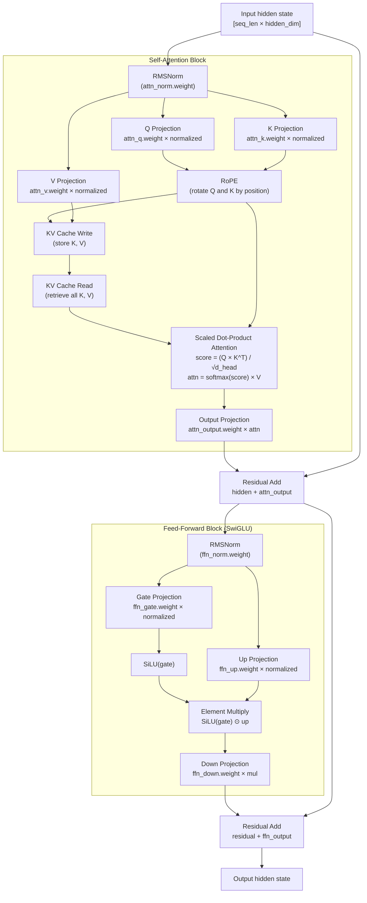
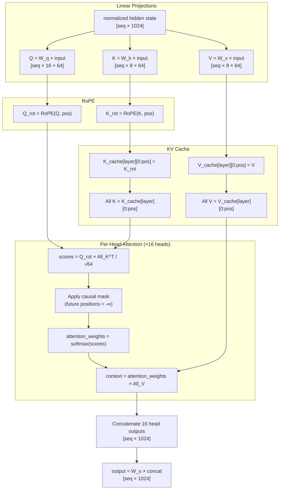
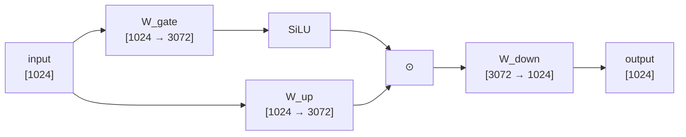
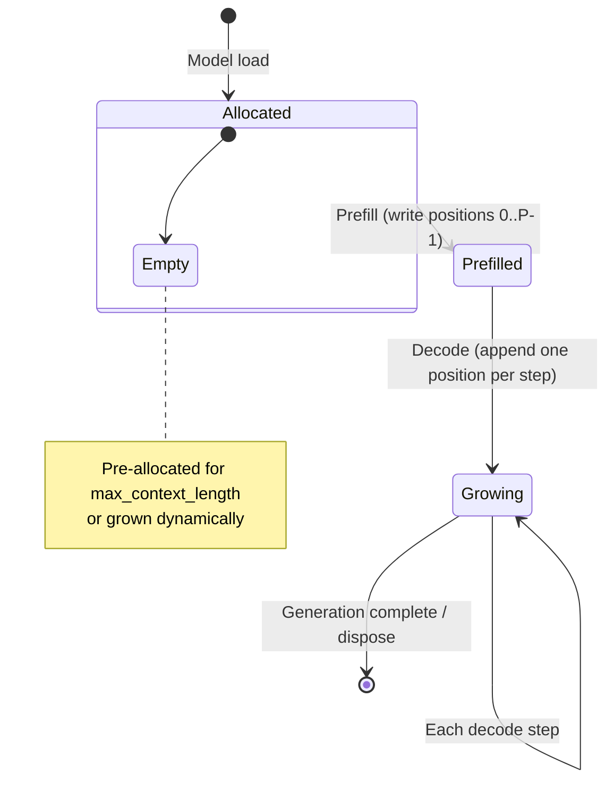
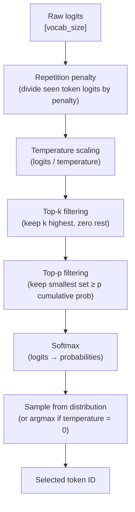

# Inference Pipeline

> Complete walkthrough of how daisi-llama transforms input text into generated output.
> [Definitions](definitions.md) | [Architecture](architecture.md) | [Roadmap](../README.md#roadmap)

---

## Pipeline Overview



---

## Full Token Generation Sequence



---

## Per-Layer Detail

Each transformer layer performs the same sequence of operations. The input is a hidden state vector (or matrix during prefill) and the output is an updated hidden state of the same shape.



---

## Attention Mechanism

### Multi-Head Attention with Grouped Query Attention (GQA)

Qwen 3.5 0.8B uses GQA: 16 query heads share 8 KV heads (ratio 2:1). Each pair of query heads shares the same K and V head.



### RoPE (Rotary Position Embedding)

RoPE encodes position by rotating pairs of dimensions using sinusoidal functions:

```
For dimension pair (2i, 2i+1) at position p:
    θ_i = rope_base^(-2i / d_head)
    q_rot[2i]   = q[2i] × cos(p × θ_i) - q[2i+1] × sin(p × θ_i)
    q_rot[2i+1] = q[2i] × sin(p × θ_i) + q[2i+1] × cos(p × θ_i)
```

The `rope_base` (theta) for Qwen 3.5 is 1,000,000 — a high value that extends effective context length.

---

## Feed-Forward Network (SwiGLU)

The SwiGLU FFN uses three weight matrices and a gated activation:

```
gate  = W_gate × input       [hidden_dim → intermediate_dim]
up    = W_up × input          [hidden_dim → intermediate_dim]
fused = SiLU(gate) ⊙ up       [element-wise multiply]
output = W_down × fused       [intermediate_dim → hidden_dim]
```

Where `SiLU(x) = x × σ(x)` and `σ` is the sigmoid function.



For Qwen 3.5 0.8B: hidden_dim = 1024, intermediate_dim = 3072. The FFN has 3× the parameters of a single attention layer (three matrices of 1024×3072 vs four matrices but with smaller KV projections).

---

## KV Cache

The KV cache avoids recomputing keys and values for previously processed tokens.

### Lifecycle



### Memory layout

```
Layer L, KV Cache:
┌──────────────────────────────────────────────────┐
│ K_cache[L]: [max_seq_len × kv_heads × head_dim] │  ← Written sequentially
│ V_cache[L]: [max_seq_len × kv_heads × head_dim] │  ← Read entirely each step
└──────────────────────────────────────────────────┘
```

**Memory cost per layer** (FP16, Qwen 3.5 0.8B):
- KV heads = 8, head_dim = 64, per position = 8 × 64 × 2 bytes × 2 (K+V) = **2 KB**
- At 32K context: 2 KB × 32,768 = **64 MB per layer**, × 28 layers = **1.75 GB total**
- KV cache quantization (Q8_0) roughly halves this to ~900 MB.

---

## Prefill vs Decode

| Aspect | Prefill | Decode |
|--------|---------|--------|
| **Tokens processed** | All prompt tokens at once | One new token per step |
| **Computation** | Large matrix multiplications (compute-bound) | Small vector-matrix operations (memory-bound) |
| **KV cache** | Written for all positions | Appended one position, read entirely |
| **Bottleneck** | GPU compute (TFLOPS) | Memory bandwidth (GB/s) |
| **Batch dimension** | seq_len (hundreds to thousands) | 1 |
| **Backend optimization** | Large GEMMs, high occupancy | Fused kernels, memory coalescing |

During prefill, the attention score computation is a `[P × D] × [D × P]` matmul — compute-intensive but highly parallelizable. During decode, it's a `[1 × D] × [D × S]` matmul where S grows with context — dominated by reading KV cache from memory.

---

## Sampling Strategies

After the forward pass produces logits (one float per vocabulary token), sampling selects the next token:



### Parameter effects

| Parameter | Low value | High value |
|-----------|-----------|------------|
| **Temperature** (0.0-2.0) | Deterministic, repetitive | Creative, chaotic |
| **Top-k** (1-100) | Very focused (k=1 = greedy) | Wide candidate set |
| **Top-p** (0.0-1.0) | Narrow (few candidates) | Broad (many candidates) |
| **Repetition penalty** (1.0-2.0) | No effect | Strongly discourages repeats |
