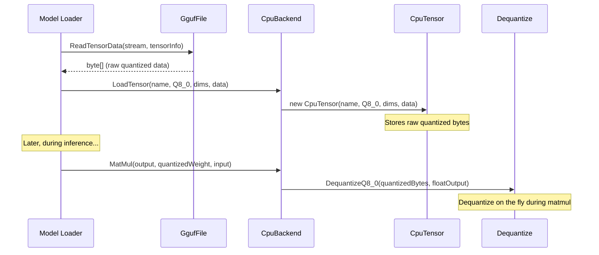

# Phase 1: Dequantization & Compute Backend Abstraction

> Build the compute abstraction layer and implement CPU dequantization for Q8_0, Q4_0, and Q4_K.
> [Definitions](../definitions.md) | [Architecture](../architecture.md) | [GGUF Format](../gguf-format.md)

---

## Goal

Establish the `IComputeBackend` and `ITensor` interfaces that all backends will implement, then build the first concrete implementation: a CPU backend that can dequantize quantized tensors to FP32.

This phase bridges the gap between "we can parse GGUF files" and "we can do math on the weights."

---

## What Gets Built

### Core library (`Daisi.Llama`)

| File | Contents |
|------|----------|
| `IComputeBackend.cs` | Interface defining all compute operations |
| `ITensor.cs` | Interface for tensor storage and access |

### CPU backend (`Daisi.Llama.Cpu`)

| File | Contents |
|------|----------|
| `CpuBackend.cs` | `IComputeBackend` implementation using managed memory |
| `CpuTensor.cs` | `ITensor` implementation backed by `float[]` or `byte[]` |
| `Dequantize.cs` | Static dequantization methods for Q8_0, Q4_0, Q4_K |

---

## Architecture

```mermaid
flowchart TD
    subgraph Core["Daisi.Llama (interfaces)"]
        IB["IComputeBackend"]
        IT["ITensor"]
    end

    subgraph Cpu["Daisi.Llama.Cpu"]
        CB["CpuBackend"]
        CT["CpuTensor\n(float[] for FP32,\nbyte[] for quantized)"]
        DQ["Dequantize\n(Q8_0, Q4_0, Q4_K → FP32)"]
    end

    CB ..|> IB
    CT ..|> IT
    CB --> CT
    CB --> DQ
```

### Data flow: loading a quantized tensor and dequantizing



---

## Key Implementation Details

### Q8_0 Dequantization

The simplest format. Each block is 34 bytes encoding 32 floats:

```
For each block b (34 bytes → 32 floats):
    scale = HalfToFloat(block[0..1])
    for i in 0..31:
        output[b*32 + i] = scale * (sbyte)block[2 + i]
```

**SIMD optimization (AVX2):**
- Load 32 signed bytes with `Vector256.LoadUnsafe`
- Widen to `Vector256<int>` (two batches of 8 via `Avx2.ConvertToVector256Int32`)
- Convert to `Vector256<float>`
- Multiply by broadcasted scale
- Store 8 floats at a time

### Q4_0 Dequantization

Each block is 18 bytes encoding 32 floats (4 bits per weight):

```
For each block b (18 bytes → 32 floats):
    scale = HalfToFloat(block[0..1])
    for i in 0..15:
        byte packed = block[2 + i]
        lo = (packed & 0x0F) - 8
        hi = (packed >> 4) - 8
        output[b*32 + 2*i]     = scale * lo
        output[b*32 + 2*i + 1] = scale * hi
```

**SIMD optimization:** Use shuffle and mask instructions to unpack nibbles into full bytes, then follow the same widen→convert→multiply pattern as Q8_0.

### Q4_K Dequantization

Most complex. Super-blocks of 256 elements with nested sub-block scales:

```
For each super-block (144 bytes → 256 floats):
    d    = HalfToFloat(bytes[0..1])
    dmin = HalfToFloat(bytes[2..3])
    scales[0..7], mins[0..7] = unpack_6bit(bytes[4..15])

    for sub_block j in 0..7:
        sub_scale = d * scales[j]
        sub_min   = dmin * mins[j]
        for i in 0..31:
            nibble = extract_4bit(bytes[16 + j*16 + i/2], i % 2)
            output[j*32 + i] = sub_scale * nibble - sub_min
```

The 6-bit scale unpacking requires careful bit manipulation (lower 4 bits stored in first 8 bytes, upper 2 bits packed into remaining 4 bytes).

---

## Test Plan

| Test | Input | Expected Output | Validates |
|------|-------|-----------------|-----------|
| `DequantizeQ8_0_SingleBlock` | Hand-crafted 34-byte block | Known FP32 values | Basic Q8_0 math |
| `DequantizeQ8_0_MultipleBlocks` | Multiple blocks | Correct values across block boundaries | Block iteration |
| `DequantizeQ4_0_SingleBlock` | Hand-crafted 18-byte block | Known FP32 values with ±8 offset | Nibble unpacking, centering |
| `DequantizeQ4_K_SingleSuperBlock` | Hand-crafted 144-byte super-block | Known FP32 values | Sub-block scales, 6-bit unpacking |
| `DequantizeQ8_0_MatchesReference` | Tensor from Qwen 3.5 Q8_0 | Matches llama.cpp reference output | Real-model validation |
| `CpuBackend_CreateTensor_RoundTrip` | Allocate → write → read | Data preserved exactly | ITensor contract |
| `CpuBackend_LoadTensor_Q8_0` | Load from GGUF bytes | Tensor accessible, correct dims | Backend loading |
| `SIMD_DequantizeQ8_0_MatchesScalar` | Same input to both paths | Identical output | SIMD correctness |

---

## Done Criteria

- [x] `IComputeBackend` and `ITensor` interfaces defined and documented
- [x] `CpuBackend` implements `CreateTensor` and `LoadTensor`
- [x] Q8_0, Q4_0, and Q4_K dequantization produce correct FP32 output
- [x] AVX2 SIMD paths exist for Q8_0 and Q4_0 with scalar fallback
- [x] All dequantization tests pass against hand-crafted and real-model data
- [ ] Performance: Q8_0 dequantization saturates memory bandwidth on a single core
