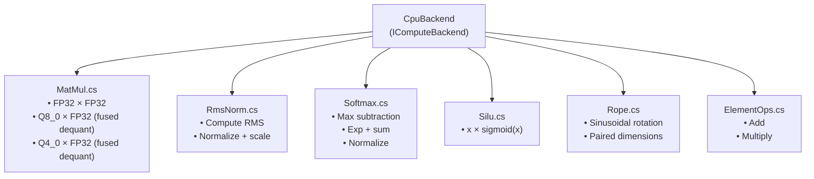
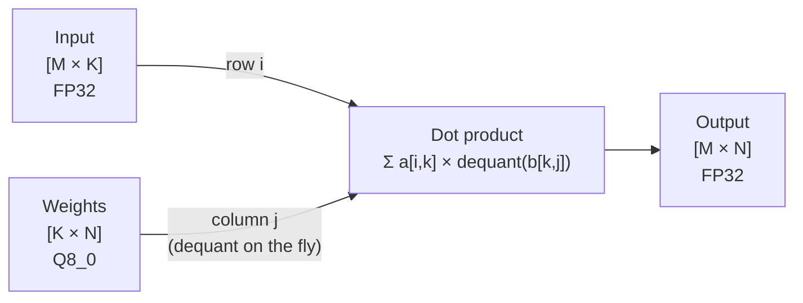

# Phase 2: CPU SIMD Math Operations

> Implement the core math primitives needed for transformer inference on CPU.
> [Definitions](../definitions.md) | [Architecture](../architecture.md) | [Inference Pipeline](../inference-pipeline.md)

---

## Goal

Implement all math operations required by `IComputeBackend` on the CPU using .NET SIMD intrinsics. After this phase, the CPU backend can perform every computation needed for a forward pass — just not wired together yet.

---

## What Gets Built

### CPU backend (`Daisi.Llogos.Cpu`)

| File | Contents |
|------|----------|
| `MatMul.cs` | Matrix multiplication with fused dequantization |
| `RmsNorm.cs` | RMS normalization |
| `Softmax.cs` | Numerically stable softmax |
| `Silu.cs` | SiLU activation function |
| `Rope.cs` | Rotary position embedding |
| `ElementOps.cs` | Element-wise add and multiply |

---

## Architecture



---

## Key Implementation Details

### MatMul (the critical operation)

Matrix multiplication dominates inference compute. The fused-dequant matmul reads quantized weights directly:



**SIMD strategy (AVX2):**
1. For each output element `C[i,j]`, compute a dot product of row `i` from A and column `j` from B
2. Process 8 floats at a time using `Vector256<float>`
3. For quantized B: load 8 bytes, widen to int32, convert to float, multiply by scale — all in registers
4. Accumulate with `Fma.MultiplyAdd` if FMA is available
5. Horizontal sum the accumulator at the end

**Loop tiling** for cache efficiency:
- Tile the K dimension to fit L1 cache (~32KB)
- Process multiple output rows to amortize weight loads

### RMSNorm

```
rms = sqrt(mean(x²) + eps)
output[i] = (x[i] / rms) * weight[i]
```

**SIMD:** Compute sum of squares using `Vector256<float>` multiply-accumulate, then broadcast `1/rms` and multiply with weight.

### Softmax (numerically stable)

```
max_val = max(input)
exp_sum = Σ exp(input[i] - max_val)
output[i] = exp(input[i] - max_val) / exp_sum
```

**Three passes:** (1) find max, (2) compute exp and sum, (3) normalize. Each pass is SIMD-accelerated.

### SiLU

```
output[i] = input[i] * sigmoid(input[i])
         = input[i] / (1 + exp(-input[i]))
```

**SIMD:** Use a fast sigmoid approximation or compute with `MathF.Exp` per element (often not the bottleneck).

### RoPE

```
For dimension pair (2i, 2i+1) at position p:
    θ = base^(-2i / d_head)
    cos_θ = cos(p * θ), sin_θ = sin(p * θ)
    q[2i]   = q[2i] * cos_θ - q[2i+1] * sin_θ
    q[2i+1] = q[2i] * sin_θ + q[2i+1] * cos_θ
```

Pre-compute sin/cos tables for all positions up to max context length.

---

## Test Plan

| Test | Validates |
|------|-----------|
| `MatMul_FP32_SmallKnown` | 2×3 × 3×2 matmul against hand-computed result |
| `MatMul_FP32_Identity` | Multiply by identity matrix → input unchanged |
| `MatMul_Q8_0_MatchesDequantThenMatMul` | Fused path matches separate dequant + FP32 matmul |
| `MatMul_Q4_0_MatchesDequantThenMatMul` | Same for Q4_0 |
| `RmsNorm_UnitVector` | Unit vector → output equals weight |
| `RmsNorm_KnownValues` | Hand-computed expected output |
| `Softmax_UniformInput` | Equal inputs → uniform distribution |
| `Softmax_LargeValues` | No overflow with inputs > 100 |
| `Softmax_SumsToOne` | Output sums to 1.0 (within epsilon) |
| `SiLU_KnownValues` | Compare against `x * sigmoid(x)` |
| `SiLU_Zero` | SiLU(0) = 0 |
| `RoPE_Position0` | No rotation at position 0 (cos=1, sin=0) |
| `RoPE_Roundtrip` | Apply at pos p, then at -p → original (approximate) |
| `ElementMul_KnownValues` | Hand-computed element-wise product |
| `ElementAdd_KnownValues` | Hand-computed element-wise sum |

---

## Done Criteria

- [x] All `IComputeBackend` math operations implemented in `CpuBackend`
- [x] AVX2 SIMD paths for MatMul, RmsNorm, ElementOps
- [x] Fused dequant+matmul for Q8_0
- [x] All tests pass
- [ ] MatMul performance: ≥ 1 GFLOPS single-threaded on modern x64 CPU
