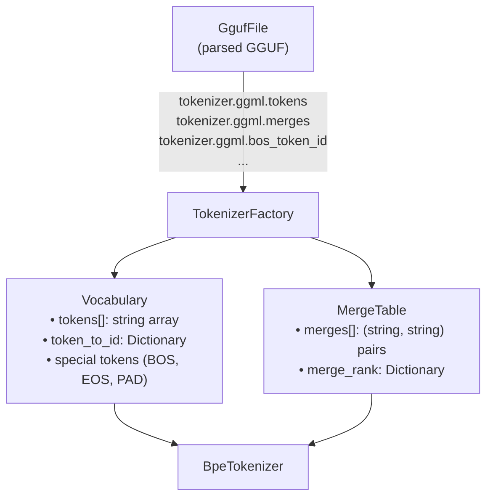
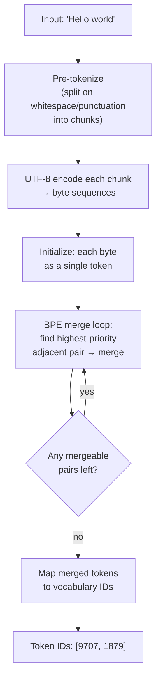

# Phase 3: BPE Tokenizer

> Build a Byte Pair Encoding tokenizer from GGUF metadata.
> [Definitions](../definitions.md) | [GGUF Format](../gguf-format.md)

---

## Goal

Implement a BPE tokenizer that reads vocabulary and merge rules from GGUF metadata. After this phase, we can convert text to token IDs and back — the input/output boundary for inference.

---

## What Gets Built

### Core library (`Daisi.Llama`)

| File | Contents |
|------|----------|
| `Tokenizer/BpeTokenizer.cs` | Main tokenizer: encode (text → tokens) and decode (tokens → text) |
| `Tokenizer/Vocabulary.cs` | Token ID ↔ string mapping, special tokens |
| `Tokenizer/MergeTable.cs` | BPE merge rules, priority-ordered |
| `Tokenizer/TokenizerFactory.cs` | Builds a tokenizer from `GgufFile` metadata |

---

## Architecture



### Encoding flow



---

## Key Implementation Details

### BPE Encoding Algorithm

```
function encode(text):
    chunks = pre_tokenize(text)     // split on regex pattern
    token_ids = []
    for chunk in chunks:
        symbols = [byte_to_token(b) for b in utf8_encode(chunk)]

        // iteratively merge highest-priority pairs
        while len(symbols) > 1:
            best_pair = None
            best_rank = ∞
            for i in 0..len(symbols)-2:
                pair = (symbols[i], symbols[i+1])
                rank = merge_table.get_rank(pair)
                if rank < best_rank:
                    best_rank = rank
                    best_pair = (i, pair)

            if best_pair is None: break
            merged = best_pair.1.0 + best_pair.1.1
            symbols[best_pair.0] = merged
            symbols.remove(best_pair.0 + 1)

        token_ids.extend([vocab.get_id(s) for s in symbols])
    return token_ids
```

**Optimization:** Use a priority queue (min-heap) of adjacent pairs ranked by merge priority. When a merge occurs, update only the affected neighbors rather than rescanning the entire sequence.

### Pre-tokenization

Qwen models use a regex-based pre-tokenizer that splits on:
- Whitespace boundaries
- Punctuation
- Digit sequences
- Letter sequences

The exact pattern is stored in GGUF metadata (`tokenizer.ggml.pre` or derived from the tokenizer type).

### Special Tokens

| Token | Metadata Key | Typical ID | Purpose |
|-------|-------------|------------|---------|
| BOS | `tokenizer.ggml.bos_token_id` | 151643 | Beginning of sequence |
| EOS | `tokenizer.ggml.eos_token_id` | 151645 | End of sequence / stop |
| PAD | `tokenizer.ggml.padding_token_id` | 151643 | Padding (often = BOS) |

### Decoding

Decoding is simpler — just look up each token ID in the vocabulary and concatenate:

```
function decode(token_ids):
    text = ""
    for id in token_ids:
        text += vocab.tokens[id]
    return utf8_decode(text)
```

Handle special byte tokens (e.g., `<0x0A>` for newline) by converting them back to the literal byte.

---

## Test Plan

| Test | Validates |
|------|-----------|
| `Encode_SimpleWord` | "hello" → expected token IDs |
| `Encode_Whitespace` | Space handling and pre-tokenization |
| `Encode_EmptyString` | Returns empty array |
| `Encode_SpecialChars` | Punctuation, unicode, emoji |
| `Decode_RoundTrip` | encode then decode = original text |
| `Decode_SpecialTokens` | BOS/EOS rendered or skipped as appropriate |
| `MergeTable_Priority` | Higher-priority merges happen first |
| `TokenizerFactory_FromQwen` | Build from real Qwen 3.5 GGUF metadata |
| `Encode_MatchesReference` | Output matches llama.cpp tokenization for known inputs |

---

## Done Criteria

- [ ] `BpeTokenizer` encodes and decodes text correctly
- [ ] Built from GGUF metadata (no external tokenizer files)
- [ ] Special tokens (BOS, EOS) handled
- [ ] Round-trip: `decode(encode(text)) == text` for valid UTF-8 inputs
- [ ] Matches llama.cpp tokenization output for a set of reference strings
