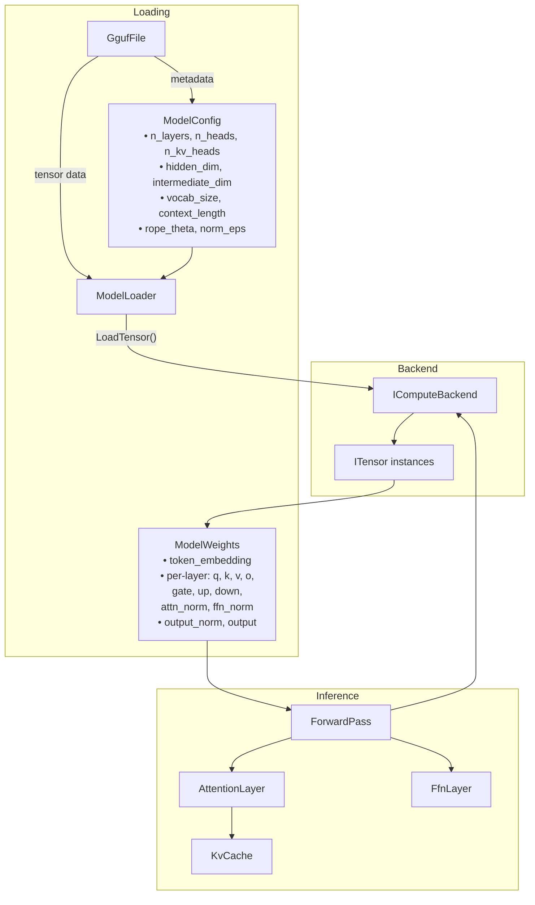
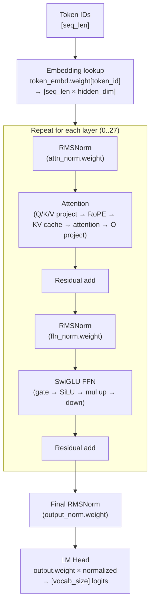

# Phase 4: Model Loading & Forward Pass

> Load model weights and implement the standard transformer forward pass.
> [Definitions](../definitions.md) | [Architecture](../architecture.md) | [Inference Pipeline](../inference-pipeline.md)

---

## Goal

Wire everything together: load a GGUF model into backend tensors and run a complete forward pass through all transformer layers. After this phase, given a sequence of token IDs, we produce logits — but don't yet generate text.

---

## What Gets Built

### Core library (`Daisi.Llama`)

| File | Contents |
|------|----------|
| `Model/ModelConfig.cs` | Model hyperparameters extracted from GGUF metadata |
| `Model/ModelLoader.cs` | Loads GGUF tensors into an `IComputeBackend` |
| `Model/ModelWeights.cs` | Named references to all loaded weight tensors |
| `Inference/ForwardPass.cs` | Standard transformer forward pass |
| `Inference/AttentionLayer.cs` | Single attention layer computation |
| `Inference/FfnLayer.cs` | Single SwiGLU FFN layer computation |
| `Inference/KvCache.cs` | KV cache allocation and management |

---

## Architecture



### Forward pass flow



---

## Key Implementation Details

### ModelConfig (extracted from GGUF metadata)

```
general.architecture      → architecture name (e.g., "qwen3")
{arch}.block_count        → n_layers (28)
{arch}.embedding_length   → hidden_dim (1024)
{arch}.feed_forward_length → intermediate_dim (3072)
{arch}.attention.head_count → n_heads (16)
{arch}.attention.head_count_kv → n_kv_heads (8)
{arch}.context_length     → max_context (32768)
{arch}.rope.freq_base     → rope_theta (1000000.0)
{arch}.attention.layer_norm_rms_epsilon → norm_eps (1e-6)
tokenizer.ggml.tokens     → vocab_size (from array length)
```

### ModelLoader tensor mapping

The loader maps GGUF tensor names to structured model weights:

```
token_embd.weight        → ModelWeights.TokenEmbedding
blk.{i}.attn_norm.weight → ModelWeights.Layers[i].AttnNorm
blk.{i}.attn_q.weight    → ModelWeights.Layers[i].AttnQ
blk.{i}.attn_k.weight    → ModelWeights.Layers[i].AttnK
blk.{i}.attn_v.weight    → ModelWeights.Layers[i].AttnV
blk.{i}.attn_output.weight → ModelWeights.Layers[i].AttnO
blk.{i}.ffn_norm.weight  → ModelWeights.Layers[i].FfnNorm
blk.{i}.ffn_gate.weight  → ModelWeights.Layers[i].FfnGate
blk.{i}.ffn_up.weight    → ModelWeights.Layers[i].FfnUp
blk.{i}.ffn_down.weight  → ModelWeights.Layers[i].FfnDown
output_norm.weight        → ModelWeights.OutputNorm
output.weight             → ModelWeights.Output
```

### KV Cache

Allocated at model load time, one K tensor and one V tensor per layer:

```
K_cache[layer] = backend.CreateTensor($"kv_k_{layer}", F32, [max_seq, n_kv_heads, head_dim])
V_cache[layer] = backend.CreateTensor($"kv_v_{layer}", F32, [max_seq, n_kv_heads, head_dim])
```

Each forward pass writes new K/V entries at the current position and reads all entries up to that position for attention computation.

### Scratch Buffers

Pre-allocated FP32 buffers reused across layers to avoid per-layer allocation:

| Buffer | Shape | Purpose |
|--------|-------|---------|
| `hidden` | `[seq_len × hidden_dim]` | Current hidden state |
| `residual` | `[seq_len × hidden_dim]` | Residual connection |
| `norm_out` | `[seq_len × hidden_dim]` | RMSNorm output |
| `q` | `[seq_len × n_heads × head_dim]` | Query projection |
| `k` | `[seq_len × n_kv_heads × head_dim]` | Key projection |
| `v` | `[seq_len × n_kv_heads × head_dim]` | Value projection |
| `attn_out` | `[seq_len × hidden_dim]` | Attention output |
| `gate` | `[seq_len × intermediate_dim]` | FFN gate |
| `up` | `[seq_len × intermediate_dim]` | FFN up |
| `ffn_out` | `[seq_len × hidden_dim]` | FFN output |

---

## Test Plan

| Test | Validates |
|------|-----------|
| `ModelConfig_FromQwen35` | Correct config extraction from real GGUF |
| `ModelLoader_LoadsAllTensors` | Every expected tensor is loaded, correct shapes |
| `ModelLoader_TensorShapes` | Dimensions match config |
| `ForwardPass_SingleToken_ProducesLogits` | One token in → vocab_size logits out |
| `ForwardPass_LogitsNotAllZero` | Output has meaningful (non-zero) values |
| `ForwardPass_LogitsShape` | Output shape is [vocab_size] |
| `ForwardPass_Deterministic` | Same input → same output |
| `KvCache_WriteRead_RoundTrip` | Write K/V at position, read back correctly |
| `Attention_SingleHead_KnownValues` | Small hand-crafted Q/K/V → known attention output |
| `SwiGLU_KnownValues` | Small input → known FFN output |

---

## Done Criteria

- [x] Model loads from GGUF into CPU backend (all tensors, correct shapes)
- [x] Forward pass runs on Qwen 3.5 0.8B Q8_0 without errors
- [x] Output logits have correct shape (vocab_size)
- [x] Output is deterministic (same input → same output)
- [x] KV cache correctly stores and retrieves per-position K/V
- [x] Scratch buffers are reused (no per-layer allocation)
- [x] Hybrid architecture: both standard attention and DeltaNet layers
- [x] Gated attention with Q/K norms and partial RoPE
- [x] DeltaNet state machine with conv1d shift buffers
