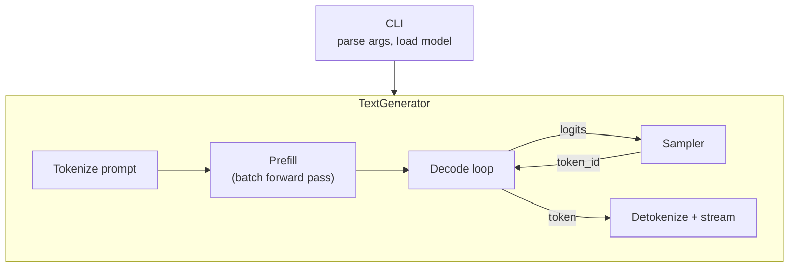
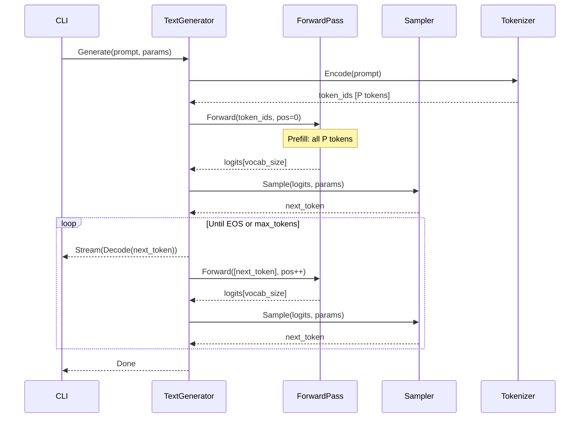
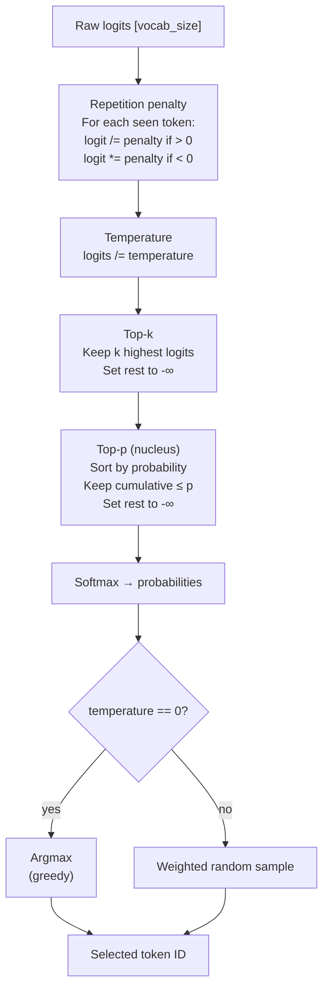

# Phase 5: Text Generation

> Sampling, the generation loop, and a working CLI.
> [Definitions](../definitions.md) | [Inference Pipeline](../inference-pipeline.md)

---

## Goal

Complete the inference pipeline: sample tokens from logits, run the autoregressive generation loop, and expose it through the CLI. After this phase, daisi-llama generates text on CPU — the first end-to-end milestone.

---

## What Gets Built

### Core library (`Daisi.Llama`)

| File | Contents |
|------|----------|
| `Inference/Sampler.cs` | Logit processing and token sampling |
| `Inference/GenerationParams.cs` | Temperature, top-k, top-p, repetition penalty, max tokens |
| `Inference/TextGenerator.cs` | Prefill + decode loop, streaming output |

### CLI (`Daisi.Llama.Cli`)

| File | Contents |
|------|----------|
| `Program.cs` | Load model, accept prompt, generate text, print output |
| `CliOptions.cs` | Command-line argument parsing (model path, params) |

---

## Architecture



### Generation sequence



---

## Key Implementation Details

### Sampler

The sampler transforms raw logits into a selected token ID through a configurable pipeline:



### GenerationParams

| Parameter | Type | Default | Description |
|-----------|------|---------|-------------|
| `MaxTokens` | int | 256 | Maximum tokens to generate |
| `Temperature` | float | 0.7 | Sampling temperature |
| `TopK` | int | 40 | Top-k filter (0 = disabled) |
| `TopP` | float | 0.9 | Nucleus sampling threshold |
| `RepetitionPenalty` | float | 1.1 | Repetition penalty factor |
| `StopTokens` | int[] | [EOS] | Token IDs that stop generation |

### CLI Usage

```
daisi-llama --model C:\GGUFS\Qwen3.5-0.8B-Q8_0.gguf --prompt "Hello, world"

Options:
  --model <path>         Path to GGUF model file (required)
  --prompt <text>        Input prompt (required)
  --max-tokens <n>       Maximum tokens to generate (default: 256)
  --temperature <f>      Sampling temperature (default: 0.7)
  --top-k <n>            Top-k sampling (default: 40)
  --top-p <f>            Top-p nucleus sampling (default: 0.9)
  --repeat-penalty <f>   Repetition penalty (default: 1.1)
  --backend <name>       Compute backend: cpu, cuda (default: cpu)
  --threads <n>          CPU threads for matmul (default: auto)
```

### Streaming

`TextGenerator` uses `IAsyncEnumerable<string>` to stream tokens as they are generated:

```csharp
await foreach (var token in generator.GenerateAsync(prompt, parameters))
{
    Console.Write(token);
}
```

---

## Test Plan

| Test | Validates |
|------|-----------|
| `Sampler_Greedy_SelectsMaxLogit` | Temperature=0 picks highest logit |
| `Sampler_Temperature_IncreasesEntropy` | Higher temperature → more spread distribution |
| `Sampler_TopK_FiltersLowProbability` | Only top-k tokens have non-zero probability |
| `Sampler_TopP_CumulativeThreshold` | Tokens beyond cumulative p are filtered |
| `Sampler_RepetitionPenalty_ReducesSeen` | Seen tokens get lower probability |
| `TextGenerator_StopsAtEOS` | Generation halts on EOS token |
| `TextGenerator_StopsAtMaxTokens` | Generation halts at max token count |
| `TextGenerator_ProducesValidText` | Output decodes to valid UTF-8 |
| `TextGenerator_EndToEnd_Qwen35` | Full generation with real model produces coherent text |

---

## Done Criteria

- [ ] Sampler implements temperature, top-k, top-p, repetition penalty
- [ ] Text generator runs prefill + decode loop with streaming output
- [ ] CLI accepts model path and parameters, generates text
- [ ] End-to-end: `daisi-llama --model qwen.gguf --prompt "Hello"` produces readable output
- [ ] Generation stops at EOS token or max token limit
- [ ] Performance: measurable tokens/sec reported at end of generation
