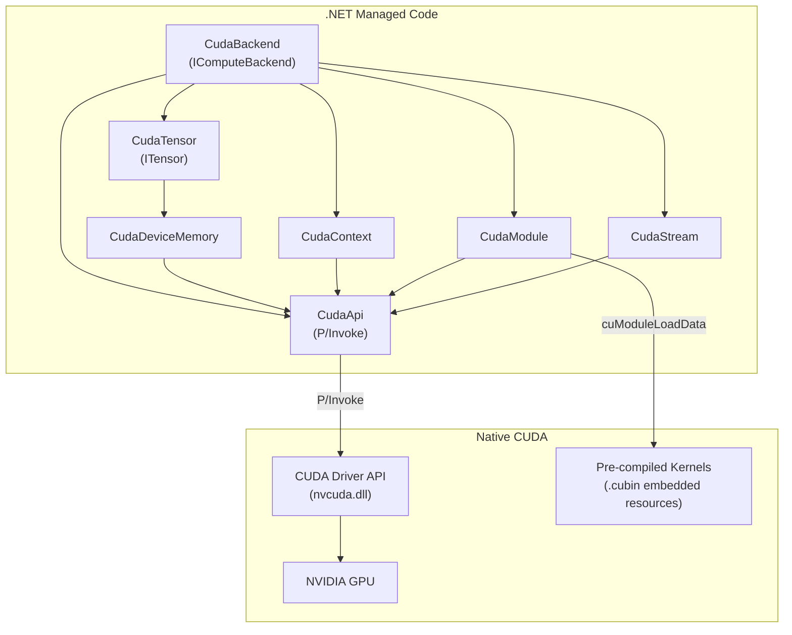
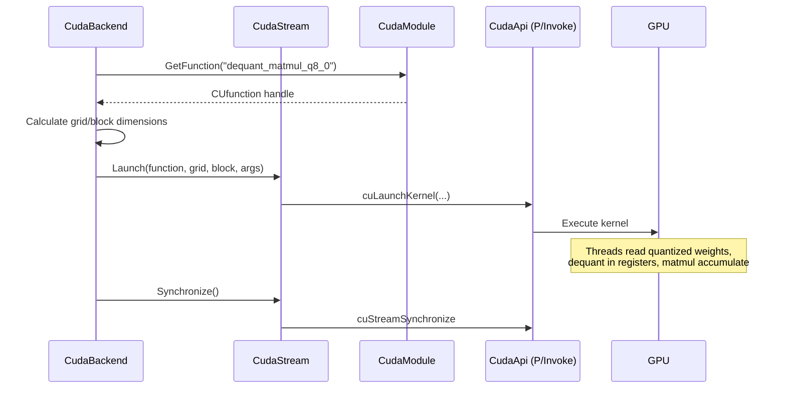

# Phase 6: CUDA Backend

> NVIDIA GPU compute backend with fused dequantization kernels.
> [Definitions](../definitions.md) | [Architecture](../architecture.md) | [CUDA Backend Design](../cuda-backend.md)

---

## Goal

Implement the CUDA compute backend: P/Invoke bindings to the CUDA Driver API, device memory management with SafeHandle wrappers, pre-compiled .cubin kernels for all inference operations, and fused dequant+matmul for Q8_0/Q4_0/Q4_K.

After this phase, daisi-llama runs inference on NVIDIA GPUs with significant speedup over CPU.

---

## What Gets Built

### CUDA backend (`Daisi.Llama.Cuda`)

| File | Contents |
|------|----------|
| `CudaApi.cs` | P/Invoke declarations for CUDA Driver API |
| `CudaContext.cs` | CUDA context management (SafeHandle) |
| `CudaModule.cs` | .cubin module loading (SafeHandle) |
| `CudaStream.cs` | CUDA stream wrapper (SafeHandle) |
| `CudaDeviceMemory.cs` | Device memory allocation (SafeHandle) |
| `CudaTensor.cs` | `ITensor` backed by device memory |
| `CudaBackend.cs` | `IComputeBackend` using CUDA kernels |

### CUDA kernels (`kernels/`)

| File | Kernels |
|------|---------|
| `dequant_matmul.cu` | Fused dequant+matmul for Q8_0, Q4_0, Q4_K |
| `elementwise.cu` | RMSNorm, softmax, SiLU, RoPE, add, mul |

### Build integration

| File | Contents |
|------|---------|
| `build-kernels.ps1` | Script to compile .cu → .cubin for target architectures |
| Embedded resources | .cubin files embedded in the assembly |

---

## Architecture



### Kernel launch flow



---

## Key Implementation Details

### P/Invoke Bindings

Bind to `nvcuda.dll` (Windows) / `libcuda.so` (Linux):

```csharp
[DllImport("nvcuda", EntryPoint = "cuInit")]
static extern CUresult cuInit(uint flags);

[DllImport("nvcuda", EntryPoint = "cuMemAlloc_v2")]
static extern CUresult cuMemAlloc(out CUdeviceptr dptr, ulong bytesize);
```

Note the `_v2` suffix on some functions — the CUDA Driver API uses versioned entry points.

### SafeHandle Resource Management

Every CUDA resource type gets a SafeHandle wrapper:

| Resource | SafeHandle | Cleanup function |
|----------|-----------|-----------------|
| Context | `CudaContextHandle` | `cuCtxDestroy` |
| Module | `CudaModuleHandle` | `cuModuleUnload` |
| Stream | `CudaStreamHandle` | `cuStreamDestroy` |
| Device memory | `CudaDeviceMemoryHandle` | `cuMemFree` |

### Fused Dequant+MatMul Kernels

Three kernel variants, one per quantization type:

**Q8_0 kernel pseudocode:**
```cuda
__global__ void dequant_matmul_q8_0(
    half* output,           // [M × N]
    const block_q8_0* A,    // [M × K] quantized
    const float* B,         // [K × N] activation
    int M, int K, int N)
{
    // Each thread block computes a tile of the output
    int row = blockIdx.y * TILE_M + threadIdx.y;
    int col = blockIdx.x * TILE_N + threadIdx.x;

    float acc = 0.0f;
    for (int kb = 0; kb < K; kb += 32) {
        // Load Q8_0 block: 2-byte scale + 32 int8 weights
        float scale = __half2float(A[row * (K/32) + kb/32].d);
        int8_t* quants = A[row * (K/32) + kb/32].qs;

        for (int i = 0; i < 32; i++) {
            acc += (scale * quants[i]) * B[(kb + i) * N + col];
        }
    }
    output[row * N + col] = acc;
}
```

### Memory Transfer Strategy

| Operation | Transfer | Frequency |
|-----------|----------|-----------|
| Model load | H2D (weights) | Once |
| Forward pass | None (all on device) | Every step |
| Get logits | D2H (vocab_size floats) | Every decode step |
| Input tokens | H2D (int array) | Once per generate call |

---

## Test Plan

| Test | Validates |
|------|-----------|
| `CudaContext_CreateDestroy` | Context lifecycle, proper cleanup |
| `CudaDeviceMemory_AllocFree` | Memory allocation and SafeHandle release |
| `CudaDeviceMemory_H2D_D2H_RoundTrip` | Data survives host→device→host |
| `CudaModule_LoadEmbeddedCubin` | Kernel binary loads from embedded resource |
| `CudaMatMul_FP32_MatchesCpu` | GPU matmul matches CPU reference |
| `CudaMatMul_Q8_0_MatchesCpu` | Fused dequant+matmul matches CPU |
| `CudaRmsNorm_MatchesCpu` | GPU RMSNorm matches CPU |
| `CudaSoftmax_MatchesCpu` | GPU softmax matches CPU |
| `CudaBackend_ForwardPass_MatchesCpu` | Full forward pass matches CPU output (within tolerance) |
| `CudaBackend_Generate_ProducesText` | End-to-end generation on GPU |

All GPU-vs-CPU comparison tests should use a tolerance of ~1e-3 (FP32 accumulation differences and reordering).

---

## Done Criteria

- [ ] CUDA Driver API bindings for all required functions
- [ ] SafeHandle wrappers for context, module, stream, device memory
- [ ] Pre-compiled .cubin kernels for sm_86, sm_89, sm_100
- [ ] Fused dequant+matmul kernels for Q8_0, Q4_0, Q4_K
- [ ] All element-wise kernels: RMSNorm, softmax, SiLU, RoPE, add, mul
- [ ] Forward pass matches CPU output within tolerance
- [ ] End-to-end text generation works on GPU
- [ ] Performance: ≥ 10x speedup over CPU for decode on RTX 3060+
