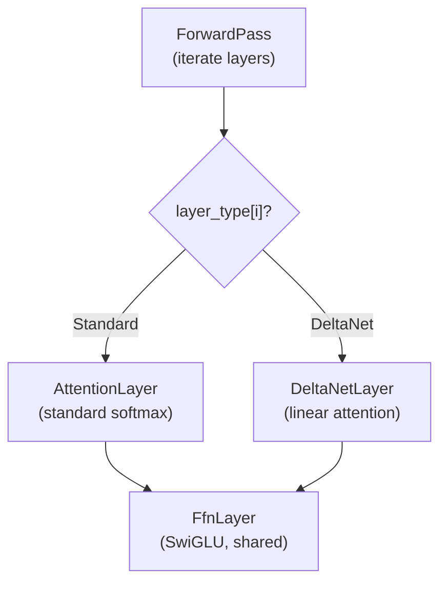
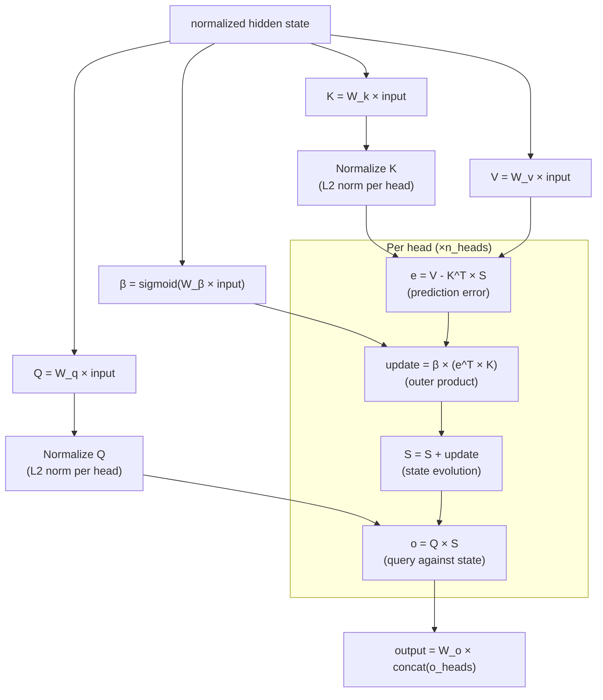

# Phase 7: DeltaNet Hybrid Architecture

> Gated DeltaNet linear attention for Qwen 3.5's hybrid layers.
> [Definitions](../definitions.md) | [DeltaNet Design](../deltanet.md) | [Inference Pipeline](../inference-pipeline.md)

---

## Goal

Implement the DeltaNet linear attention mechanism and integrate it into the forward pass as an alternative to standard softmax attention. After this phase, daisi-llogos correctly runs models that use the hybrid DeltaNet/standard architecture (like Qwen 3.5).

---

## What Gets Built

### Core library (`Daisi.Llogos`)

| File | Contents |
|------|----------|
| `Inference/DeltaNetLayer.cs` | DeltaNet attention computation |
| `Inference/DeltaNetState.cs` | Recurrent state matrix management |
| `Model/LayerType.cs` | Enum: Standard, DeltaNet |
| `Model/ModelConfig.cs` | Extended to parse layer schedule from metadata |

### Backend operations (`IComputeBackend` extensions)

| Operation | Description |
|-----------|-------------|
| `OuterProduct` | Vector outer product for state update |
| `Sigmoid` | Element-wise sigmoid for gate β |

### CPU backend (`Daisi.Llogos.Cpu`)

| File | Contents |
|------|----------|
| `DeltaNetOps.cs` | CPU SIMD implementation of DeltaNet-specific operations |

### CUDA backend (`Daisi.Llogos.Cuda`)

| File | Contents |
|------|----------|
| `kernels/deltanet.cu` | CUDA kernels for DeltaNet state update and output |

---

## Architecture

### Layer dispatch



### DeltaNet forward pass (single layer)



---

## Key Implementation Details

### Layer Schedule Detection

The model's GGUF metadata encodes which layers use DeltaNet. Detection approaches:

1. **Metadata key:** Look for `{arch}.attention.layer_type` or similar array metadata
2. **Tensor presence:** If layer `i` has `blk.{i}.attn_beta.weight`, it's a DeltaNet layer
3. **Architecture-specific:** Some architectures define a fixed pattern

daisi-llogos uses approach 2 (tensor presence) as the primary detection method, with metadata as an override.

### DeltaNet State Matrix

Each DeltaNet layer maintains a state matrix per attention head:

```
state[layer][head] = float[head_dim × head_dim]
```

For Qwen 3.5 0.8B (head_dim = 64):
- Per head: 64 × 64 × 4 bytes = **16 KB**
- Per layer (16 heads): **256 KB**
- Constant regardless of context length

### State Update (the core operation)

```
// Per head, per token position
e = V_head - matmul(K_head, S)          // [head_dim] error vector
update = β * outer_product(e, K_head)    // [head_dim × head_dim] update matrix
S = S + update                           // state evolution
o_head = matmul(Q_head, S)              // [head_dim] output vector
```

**CPU SIMD optimization:**
- The outer product `e^T × K` can use FMA: for each (i,j), `S[i,j] += β * e[i] * K[j]`
- With AVX2: broadcast `β * e[i]`, multiply by K vector, add to S row i

**CUDA optimization:**
- Fused kernel: compute error, outer product, state update, and output query in one launch
- Each thread block handles one head
- State matrix fits in shared memory (16 KB for head_dim=64)

### Prefill Mode

During prefill, DeltaNet processes all positions sequentially (it's inherently recurrent):

```
for pos in 0..seq_len-1:
    compute Q, K, V, β for position pos
    update state with delta rule
    compute output for position pos
```

This makes DeltaNet prefill O(seq_len × head_dim²) — slightly different from standard attention's O(seq_len² × head_dim) but similar in practice for typical dimensions.

### Q/K Normalization

DeltaNet requires L2-normalized Q and K vectors (unlike standard attention which uses scaling):

```
Q_norm = Q / ||Q||₂
K_norm = K / ||K||₂
```

This ensures the state matrix entries remain bounded.

---

## Test Plan

| Test | Validates |
|------|-----------|
| `DeltaNetState_InitializesToZero` | Fresh state is zero matrix |
| `DeltaNetState_UpdateSingleStep` | One delta update produces expected state |
| `DeltaNetState_MultipleSteps` | Sequential updates accumulate correctly |
| `DeltaNetLayer_OutputShape` | Output has correct dimensions |
| `DeltaNetLayer_MatchesReference` | Output matches reference implementation |
| `LayerType_DetectedFromTensors` | Correct detection of DeltaNet vs standard layers |
| `ForwardPass_HybridModel` | Mixed DeltaNet/standard layers produce correct output |
| `DeltaNet_PrefillMatchesStepByStep` | Batch prefill equals sequential single-step |
| `DeltaNet_CudaMatchesCpu` | GPU implementation matches CPU within tolerance |

---

## Done Criteria

- [ ] DeltaNet state management: init, update, query
- [ ] DeltaNet layer integrated into forward pass dispatch
- [ ] Layer type auto-detected from tensor names
- [ ] CPU SIMD implementation of all DeltaNet operations
- [ ] CUDA kernels for DeltaNet (fused state update + output)
- [ ] Forward pass produces correct output on hybrid Qwen 3.5 model
- [ ] State memory is constant regardless of context length
