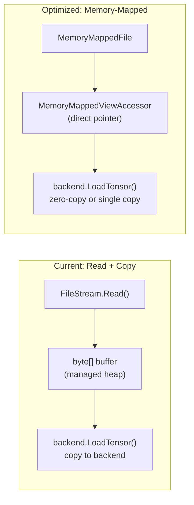
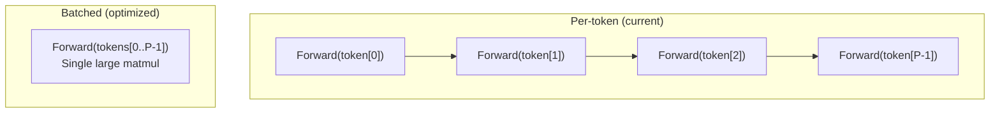
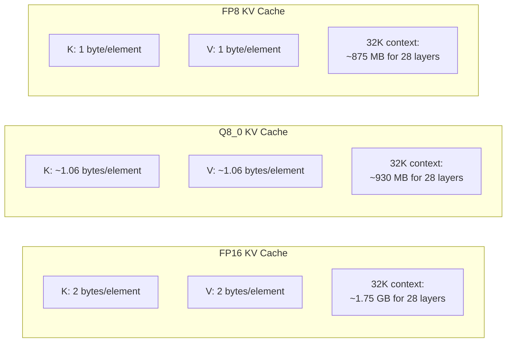
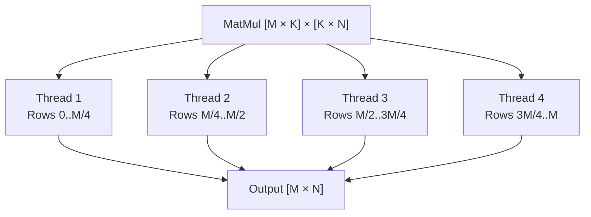

# Phase 8: Performance Optimization

> Memory-mapped loading, batch prefill, KV cache quantization, and tuning.
> [Definitions](../definitions.md) | [Inference Pipeline](../inference-pipeline.md) | [CUDA Backend](../cuda-backend.md)

---

## Goal

Optimize every stage of the pipeline for maximum throughput and minimum memory usage. This phase is about making daisi-llama fast, not just correct.

---

## What Gets Built

| Area | Optimization | Impact |
|------|-------------|--------|
| **Loading** | Memory-mapped GGUF file | Eliminate copy during model load |
| **Prefill** | Batched matrix operations | Higher GPU utilization during prompt processing |
| **KV Cache** | FP8/Q8_0 quantized KV cache | 2x longer context in same memory |
| **CPU** | Multi-threaded matmul | Linear speedup with core count |
| **CUDA** | Kernel tuning, occupancy optimization | Higher tokens/sec |
| **Memory** | Tensor pooling, zero-copy where possible | Lower peak memory |

---

## Architecture Changes

### Memory-Mapped Loading



Using `MemoryMappedFile` and `unsafe` pointer access:
- No intermediate byte[] allocation for the entire model
- The OS manages paging — only accessed regions are loaded from disk
- On CUDA: `cuMemcpyHtoD` directly from the mapped pointer

### Batch Prefill

During prefill, all prompt tokens can be processed as a single batch:



Batched prefill turns small vector-matrix multiplications into large matrix-matrix multiplications, dramatically improving GPU utilization.

### KV Cache Quantization



Quantizing the KV cache on write and dequantizing on read. The attention computation becomes:
1. Write: `K_cache[pos] = quantize(K)` — quantize K/V before storing
2. Read: `K_full = dequantize(K_cache[0:pos])` — dequantize during attention

Quality impact is minimal because attention weights act as a weighted average, smoothing quantization noise.

> **See also:** [Phase 11 (Long Context)](phase-11-long-context.md) builds on KV cache quantization with paged allocation, flash attention, and RAM offloading to support 200K+ token contexts on 16GB GPUs.

### Multi-Threaded CPU MatMul



Row-partitioned parallelism with `Parallel.For` — each thread works on independent output rows, no synchronization needed.

---

## Key Implementation Details

### Memory-Mapped File Loading

```csharp
using var mmf = MemoryMappedFile.CreateFromFile(path, FileMode.Open, null, 0, MemoryMappedFileAccess.Read);
using var accessor = mmf.CreateViewAccessor(0, 0, MemoryMappedFileAccess.Read);

byte* basePtr = null;
accessor.SafeMemoryMappedViewHandle.AcquirePointer(ref basePtr);

// For each tensor: pointer arithmetic to tensor data
byte* tensorPtr = basePtr + tensorDataOffset + tensor.Offset;
backend.LoadTensor(tensor.Name, tensor.Type, tensor.Dimensions, new ReadOnlySpan<byte>(tensorPtr, tensor.ByteSize));
```

### CUDA Kernel Tuning

| Knob | What to tune | How |
|------|-------------|-----|
| Block size | Threads per block (128, 256, 512) | Profile occupancy |
| Tile size | Shared memory tile dimensions | Balance compute vs memory |
| Unroll factor | Inner loop unrolling | Reduce loop overhead |
| Register pressure | Variables per thread | `--maxrregcount` flag |
| Shared memory | Prefer L1 vs shared | `cuFuncSetAttribute` |

### Performance Metrics

| Metric | How to measure | Target (RTX 3060) |
|--------|---------------|-------------------|
| Prefill tok/s | Prompt tokens / prefill time | ≥ 2000 tok/s (Q8_0, 0.8B) |
| Decode tok/s | Generated tokens / decode time | ≥ 60 tok/s (Q8_0, 0.8B) |
| Model load time | File open to first forward pass | ≤ 2 seconds |
| Peak VRAM | Max GPU memory allocated | ≤ 1.5 GB (Q8_0, 0.8B) |

---

## Test Plan

| Test | Validates |
|------|-----------|
| `MmapLoading_MatchesStreamLoading` | Same tensors loaded via mmap vs stream |
| `BatchPrefill_MatchesSequential` | Batched output equals sequential per-token |
| `KvCacheQ8_0_MinimalQualityLoss` | Generation output similar with/without KV quantization |
| `MultiThreadMatMul_MatchesSingleThread` | Same output regardless of thread count |
| `CudaKernel_Occupancy` | Kernel achieves ≥ 50% occupancy |

---

## Done Criteria

- [ ] Memory-mapped model loading (zero intermediate copies)
- [ ] Batched prefill for prompt processing
- [ ] KV cache quantization (Q8_0 or FP8)
- [ ] Multi-threaded CPU matmul with linear scaling
- [ ] CUDA kernels tuned for target architectures
- [ ] Performance targets met (see table above)
- [ ] Benchmark suite reports tok/s for prefill and decode
