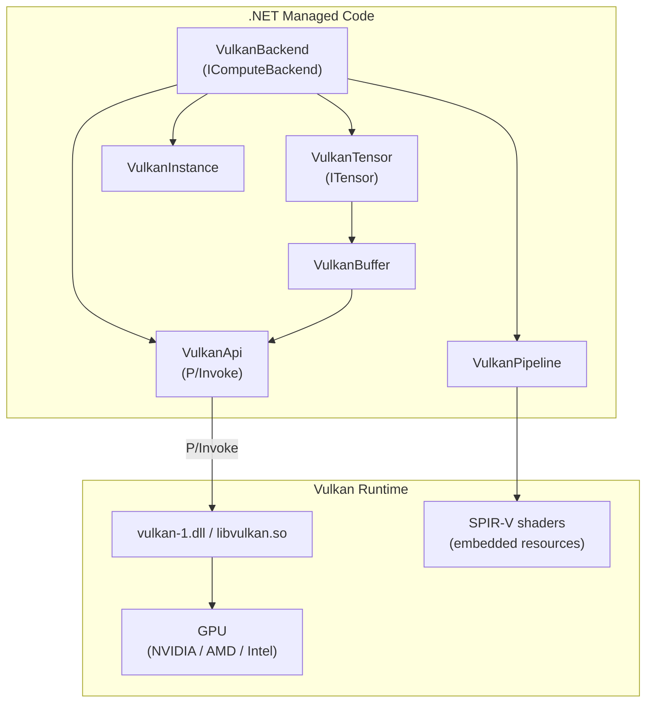
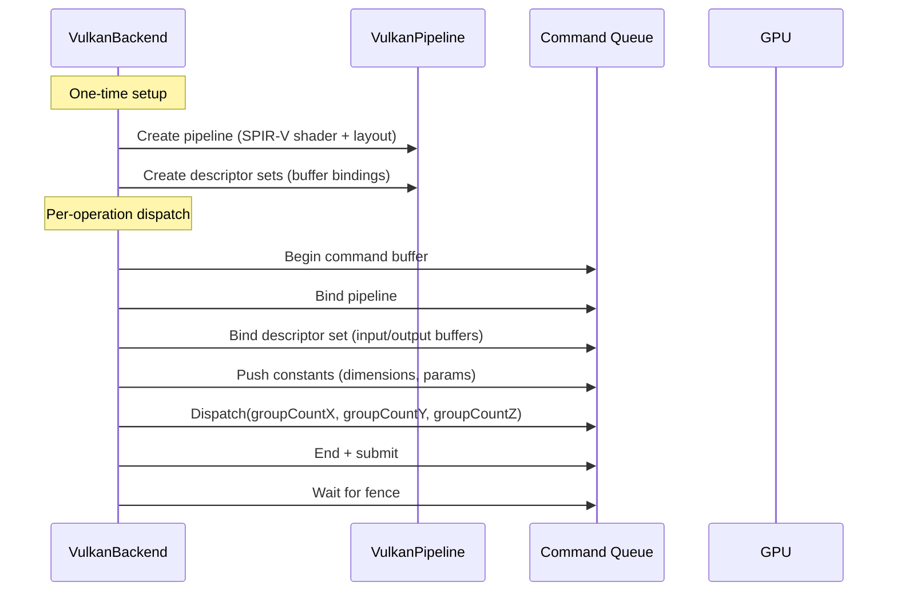
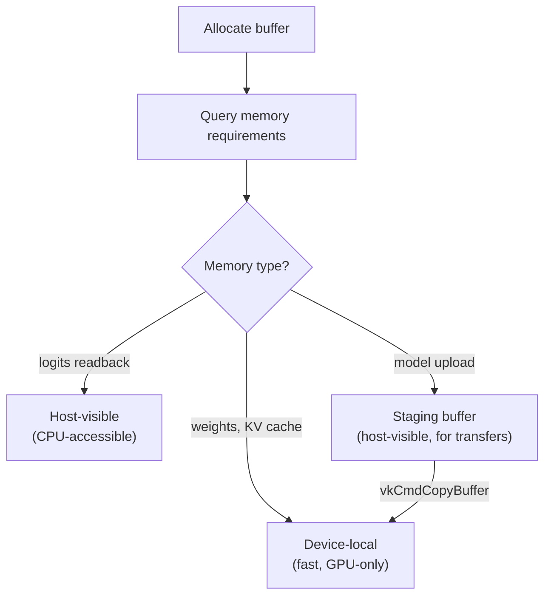

# Phase 9: Vulkan Compute Backend

> Cross-platform GPU compute via Vulkan for Windows and Linux.
> [Definitions](../definitions.md) | [Architecture](../architecture.md)

---

## Goal

Implement a Vulkan compute backend that runs inference on any Vulkan-capable GPU (NVIDIA, AMD, Intel). This extends GPU acceleration beyond NVIDIA-only CUDA to the broader GPU ecosystem.

---

## What Gets Built

### Vulkan backend (`Daisi.Llama.Vulkan`)

| File | Contents |
|------|----------|
| `VulkanApi.cs` | P/Invoke declarations for Vulkan API |
| `VulkanInstance.cs` | Vulkan instance + physical/logical device (SafeHandle) |
| `VulkanBuffer.cs` | Device buffer allocation (SafeHandle) |
| `VulkanPipeline.cs` | Compute pipeline + descriptor set management |
| `VulkanShader.cs` | SPIR-V shader loading |
| `VulkanTensor.cs` | `ITensor` backed by Vulkan device buffer |
| `VulkanBackend.cs` | `IComputeBackend` using Vulkan compute shaders |

### Compute shaders (`shaders/`)

| File | Shader |
|------|--------|
| `dequant_matmul_q8_0.comp` | Fused dequant+matmul for Q8_0 |
| `dequant_matmul_q4_0.comp` | Fused dequant+matmul for Q4_0 |
| `rms_norm.comp` | RMSNorm |
| `softmax.comp` | Softmax |
| `silu.comp` | SiLU activation |
| `rope.comp` | RoPE |
| `element_ops.comp` | Element-wise add and multiply |

---

## Architecture



### Vulkan compute pipeline



---

## Key Implementation Details

### Vulkan Compute vs CUDA

| Aspect | CUDA | Vulkan |
|--------|------|--------|
| API style | Imperative (launch kernel) | Declarative (record commands, submit) |
| Shader language | CUDA C++ | GLSL → SPIR-V |
| Memory | Unified virtual addressing | Explicit memory types (device/host-visible) |
| Synchronization | Streams + events | Fences + semaphores + barriers |
| Vendor support | NVIDIA only | NVIDIA, AMD, Intel, Qualcomm |

### GLSL Compute Shader Example (Q8_0 Dequant+MatMul)

```glsl
#version 450
layout(local_size_x = 256) in;

layout(set = 0, binding = 0) readonly buffer WeightBuf { uint8_t weights[]; };
layout(set = 0, binding = 1) readonly buffer InputBuf { float input_data[]; };
layout(set = 0, binding = 2) writeonly buffer OutputBuf { float output_data[]; };

layout(push_constant) uniform Params { uint M; uint K; uint N; };

// Each workgroup computes one output element
void main() {
    uint row = gl_GlobalInvocationID.y;
    uint col = gl_GlobalInvocationID.x;
    if (row >= M || col >= N) return;

    float acc = 0.0;
    for (uint kb = 0; kb < K; kb += 32) {
        uint blockIdx = row * (K / 32) + kb / 32;
        float scale = unpackHalf2x16(/* block scale */);
        for (uint i = 0; i < 32; i++) {
            int8_t q = int8_t(weights[blockIdx * 34 + 2 + i]);
            acc += (scale * float(q)) * input_data[(kb + i) * N + col];
        }
    }
    output_data[row * N + col] = acc;
}
```

### Memory Management

Vulkan requires explicit memory type selection:



Weight tensors and KV cache use device-local memory (fastest). Uploads use a staging buffer pattern: write to host-visible staging buffer, then copy to device-local.

---

## Test Plan

| Test | Validates |
|------|-----------|
| `VulkanInstance_Create` | Device enumeration, queue family selection |
| `VulkanBuffer_AllocFree` | Memory allocation and cleanup |
| `VulkanBuffer_UploadDownload` | Staging buffer transfer roundtrip |
| `VulkanPipeline_LoadShader` | SPIR-V loading and pipeline creation |
| `VulkanMatMul_MatchesCpu` | Compute shader output matches CPU |
| `VulkanBackend_ForwardPass_MatchesCpu` | Full forward pass matches CPU |
| `VulkanBackend_Generate` | End-to-end text generation |
| `VulkanBackend_AMD` | Works on AMD GPU (if available) |
| `VulkanBackend_Intel` | Works on Intel GPU (if available) |

---

## Done Criteria

- [x] Vulkan API bindings via P/Invoke
- [x] SafeHandle wrappers for instance, device, buffers, pipelines
- [x] SPIR-V compute shaders for all inference operations
- [x] Fused dequant+matmul for Q8_0, F32
- [x] Forward pass matches CPU output within tolerance
- [x] End-to-end generation works on NVIDIA GPU
- [ ] Performance: competitive with CUDA backend (within 20%)
- [ ] Q4_0 dequant+matmul shader
- [ ] AMD/Intel GPU validation
