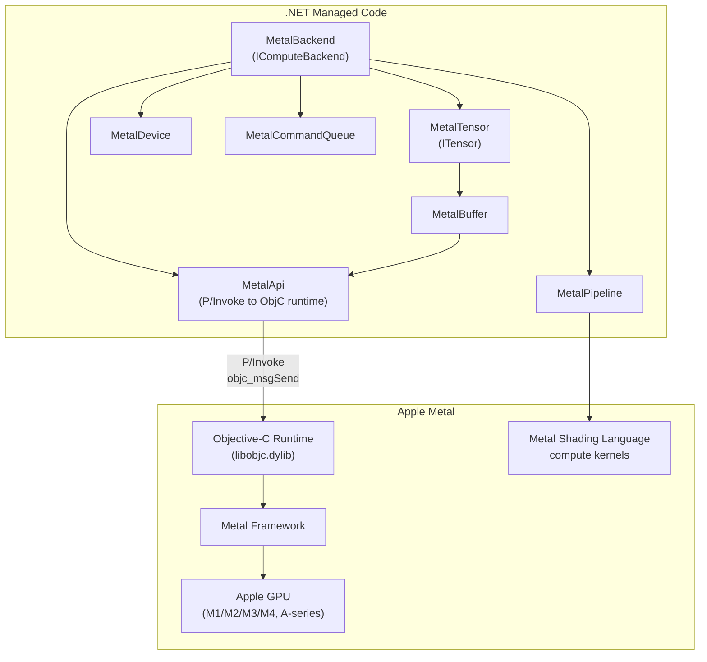
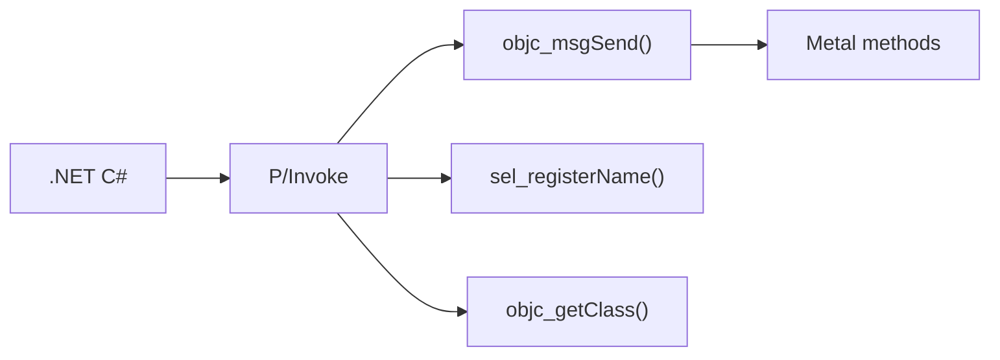
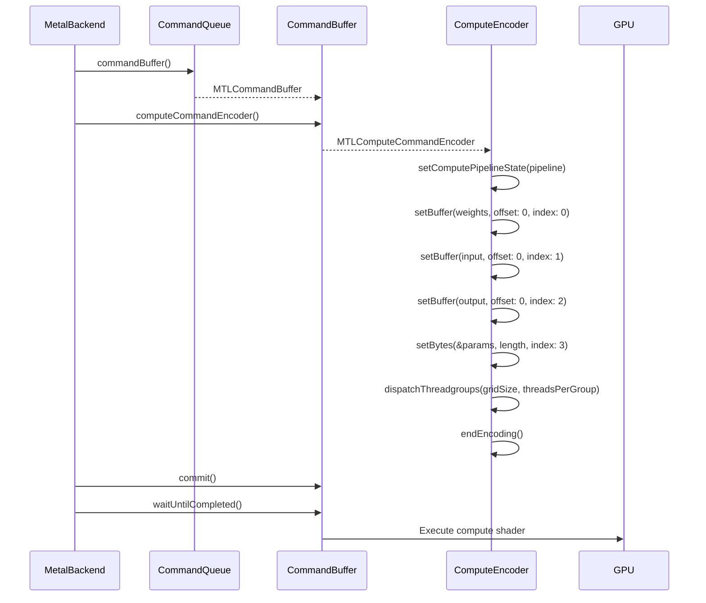
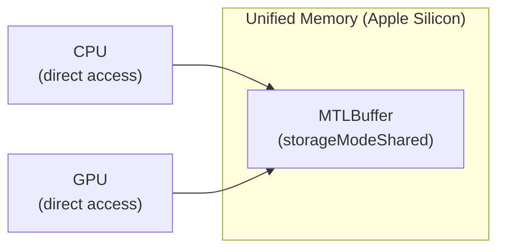

# Phase 10: Metal Backend

> Apple GPU compute for macOS (arm64, x64) and iOS.
> [Definitions](../definitions.md) | [Architecture](../architecture.md)

---

## Goal

Implement a Metal compute backend that runs inference on Apple GPUs. This enables daisi-llama on macOS (Apple Silicon and Intel Macs) and iOS devices. The iOS distribution uses an XCFramework for native integration.

---

## What Gets Built

### Metal backend (`Daisi.Llama.Metal`)

| File | Contents |
|------|----------|
| `MetalApi.cs` | P/Invoke declarations for Metal and Objective-C runtime |
| `MetalDevice.cs` | Metal device wrapper (SafeHandle) |
| `MetalBuffer.cs` | Device buffer allocation (SafeHandle) |
| `MetalPipeline.cs` | Compute pipeline state management |
| `MetalCommandQueue.cs` | Command queue and command buffer |
| `MetalTensor.cs` | `ITensor` backed by Metal buffer |
| `MetalBackend.cs` | `IComputeBackend` using Metal compute shaders |

### Metal shaders (`shaders/`)

| File | Shader |
|------|--------|
| `dequant_matmul.metal` | Fused dequant+matmul for Q8_0, Q4_0 |
| `elementwise.metal` | RMSNorm, softmax, SiLU, RoPE, add, mul |

### iOS distribution

| File | Contents |
|------|----------|
| `build-xcframework.sh` | Build script for XCFramework |
| `Daisi.Llama.Metal.xcframework` | Universal framework for iOS devices + simulators |

---

## Architecture



### Metal API access from .NET

Metal uses Objective-C APIs. From .NET, we call them via P/Invoke to the Objective-C runtime:



Key Objective-C runtime functions:
- `objc_getClass("MTLDevice")` — get class reference
- `sel_registerName("newBufferWithLength:options:")` — get selector
- `objc_msgSend(device, selector, length, options)` — call method

### Metal compute dispatch



---

## Key Implementation Details

### Metal Shading Language Kernels

MSL is C++-based with GPU-specific extensions:

```metal
#include <metal_stdlib>
using namespace metal;

struct Params {
    uint M;
    uint K;
    uint N;
};

kernel void dequant_matmul_q8_0(
    device const uint8_t* weights [[buffer(0)]],
    device const float* input     [[buffer(1)]],
    device float* output          [[buffer(2)]],
    constant Params& params       [[buffer(3)]],
    uint2 gid                     [[thread_position_in_grid]])
{
    uint row = gid.y;
    uint col = gid.x;
    if (row >= params.M || col >= params.N) return;

    float acc = 0.0f;
    for (uint kb = 0; kb < params.K; kb += 32) {
        uint blockIdx = row * (params.K / 32) + kb / 32;
        float scale = as_type<half>(/* extract scale */);
        for (uint i = 0; i < 32; i++) {
            int8_t q = as_type<int8_t>(weights[blockIdx * 34 + 2 + i]);
            acc += (scale * float(q)) * input[(kb + i) * params.N + col];
        }
    }
    output[row * params.N + col] = acc;
}
```

### Apple Silicon Unified Memory

Apple Silicon uses unified memory — CPU and GPU share the same physical memory:



This means:
- No explicit host↔device copies needed on Apple Silicon
- Use `MTLResourceStorageModeShared` for all buffers
- Model weights can be loaded directly into GPU-accessible memory
- Massive advantage for model loading speed

On Intel Macs, use `MTLResourceStorageModeManaged` with explicit `didModifyRange:` calls.

### iOS XCFramework

For iOS distribution, Metal shaders and the .NET native AOT-compiled library are packaged as an XCFramework:

```
Daisi.Llama.Metal.xcframework/
├── ios-arm64/
│   └── DaisiLlama.framework/
│       ├── DaisiLlama (native binary)
│       ├── default.metallib (compiled shaders)
│       └── Info.plist
├── ios-arm64-simulator/
│   └── DaisiLlama.framework/
└── macos-arm64-x86_64/
    └── DaisiLlama.framework/
```

### Platform differences

| Feature | macOS arm64 | macOS x64 | iOS |
|---------|------------|-----------|-----|
| GPU | M1-M4 (Apple Silicon) | Intel Iris/AMD | A-series, M-series |
| Memory model | Unified (shared) | Managed (explicit sync) | Unified (shared) |
| Max buffer size | System memory | ~70% VRAM | System memory |
| Shader compilation | Runtime or precompiled | Same | Must be precompiled |
| Distribution | .dylib or .framework | Same | XCFramework |

---

## Test Plan

| Test | Validates |
|------|-----------|
| `MetalDevice_Create` | Device discovery on macOS |
| `MetalBuffer_AllocFree` | Buffer allocation and cleanup |
| `MetalBuffer_WriteRead` | Data roundtrip through shared memory |
| `MetalPipeline_CompileShader` | MSL compilation to compute pipeline |
| `MetalMatMul_MatchesCpu` | GPU matmul matches CPU reference |
| `MetalBackend_ForwardPass_MatchesCpu` | Full forward pass matches CPU |
| `MetalBackend_Generate` | End-to-end text generation |
| `MetalBackend_UnifiedMemory` | Zero-copy buffer access on Apple Silicon |

---

## Done Criteria

- [ ] Objective-C runtime P/Invoke bindings for Metal API
- [ ] SafeHandle wrappers for device, buffer, command queue, pipeline
- [ ] MSL compute kernels for all inference operations
- [ ] Fused dequant+matmul for Q8_0, Q4_0
- [ ] Forward pass matches CPU output within tolerance
- [ ] End-to-end generation works on macOS (arm64 and x64)
- [ ] iOS XCFramework builds and runs on device
- [ ] Unified memory used on Apple Silicon (no unnecessary copies)
