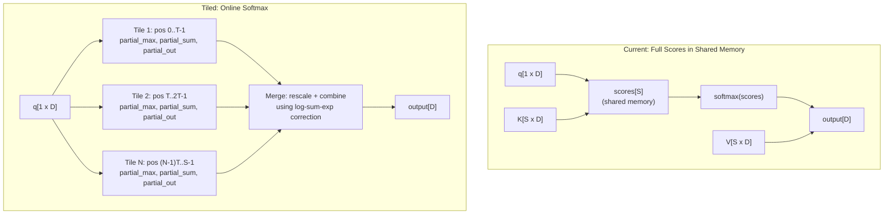
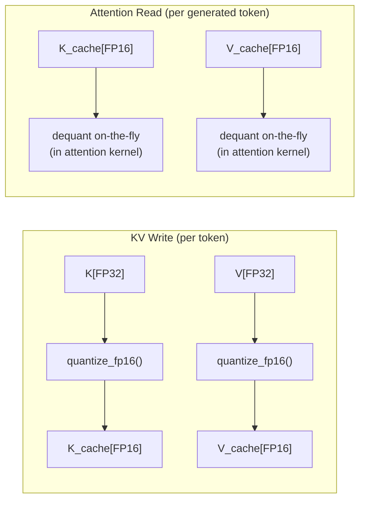
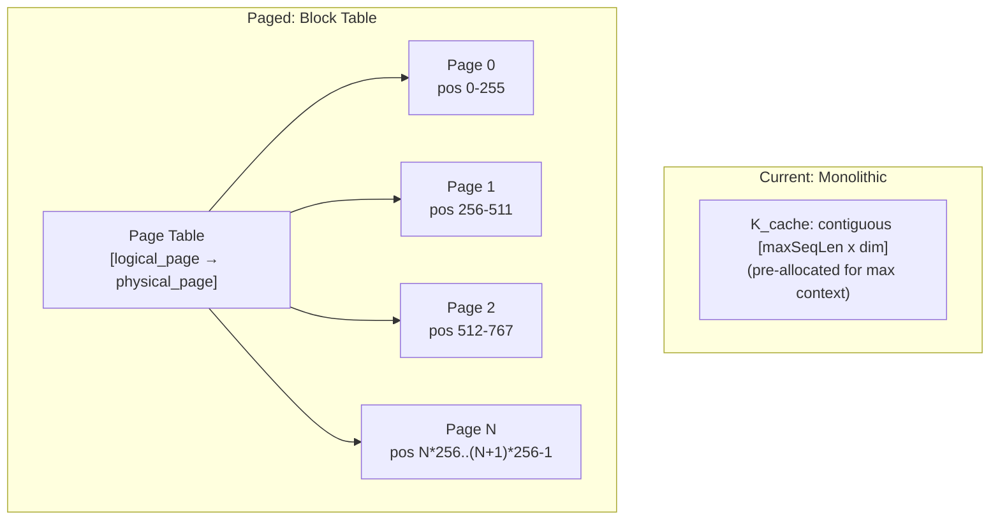
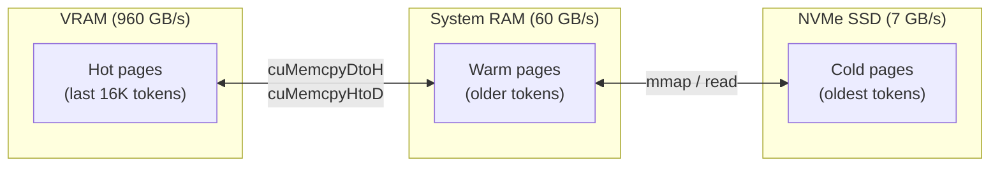
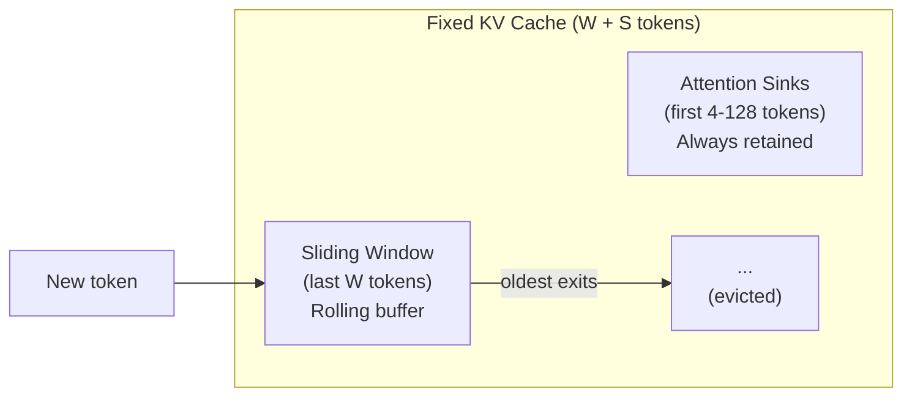
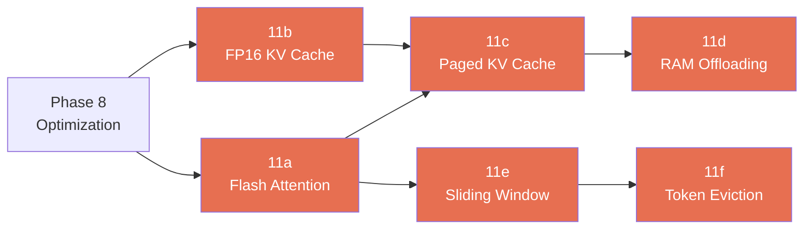

# Phase 11: Long Context Support (200K+)

> Flash attention, KV cache quantization, paged cache, RAM/SSD offloading, and streaming attention.
> [Definitions](../definitions.md) | [Inference Pipeline](../inference-pipeline.md) | [CUDA Backend](../cuda-backend.md) | [DeltaNet](../deltanet.md)

---

## Goal

Support 200K+ token context on desktop GPUs with 16GB VRAM. The Qwen 3.5 hybrid architecture (18 DeltaNet + 6 standard attention layers) gives us a natural advantage — only 6 layers need KV cache. This phase exploits that to push context length far beyond what pure-attention models can achieve in the same memory budget.

---

## Memory Analysis

### Current State (FP32 KV Cache)

| Context | KV Cache (6 layers) | Model Weights | Total VRAM | Fits 16GB? |
|---------|--------------------:|-------------:|----------:|:----------:|
| 2K | 48 MB | 850 MB | 898 MB | Yes |
| 32K | 768 MB | 850 MB | 1.6 GB | Yes |
| 200K | 4.8 GB | 850 MB | 5.65 GB | Yes |
| 1M | 24 GB | 850 MB | 24.85 GB | No |

KV cache per layer per position: `2 KV heads x 256 dim x 4 bytes x 2 (K+V)` = **4 KB**.
DeltaNet state per layer: `16 groups x 128 x 128 x 4 bytes` = **1 MB** (fixed, context-independent).

### After Optimization

| Context | FP16 KV | Q8_0 KV | Q4_0 KV | FP16 + RAM offload |
|---------|--------:|--------:|--------:|-------------------:|
| 200K | 2.4 GB | 1.28 GB | 0.68 GB | 384 MB VRAM |
| 1M | 12 GB | 6.4 GB | 3.4 GB | 384 MB VRAM |
| 10M | 120 GB | 64 GB | 34 GB | 384 MB VRAM + 12 GB RAM |

### Performance Impact (Decode tok/s)

At long context, KV cache reads during attention dominate over weight reads. RTX 5080 = 960 GB/s VRAM, ~60 GB/s system RAM.

| Context | FP32 KV | FP16 KV | Q8_0 KV | FP16 + 16K window in VRAM |
|---------|--------:|--------:|--------:|--------------------------:|
| 2K | ~42 | ~43 | ~43 | ~43 |
| 32K | ~35 | ~39 | ~41 | ~43 |
| 200K | ~25 | ~33 | ~38 | ~43 |
| 1M | — | ~15 | ~20 | ~43 |

---

## Sub-phases

### 11a: Flash Attention (Tiled/Chunked) — unblocks >12K context

**Problem:** Current `GatedAttention` kernel allocates `shared[seqLen]` for attention scores. At >12K tokens this exceeds the per-block shared memory limit (48-100KB) and crashes.

**Solution:** Tile the attention computation into chunks of T positions (e.g., T=1024). Each tile computes partial softmax, then tiles are combined using the online softmax trick (log-sum-exp correction).

**Algorithm per tile:**
1. Compute `scores[t] = q @ K_tile^T * scale` (only T scores in shared memory)
2. Find `tile_max = max(scores[0..T-1])`
3. Compute `tile_sum = sum(exp(scores - tile_max))`
4. Compute `tile_out = softmax(scores) @ V_tile`
5. Merge with running state: rescale previous output using `exp(prev_max - new_max)`, combine sums

**Shared memory:** O(T + blockDim) = constant regardless of context length.

**Files changed:**
- `composite_ops.cu` — new `gated_attention_tiled` kernel
- `CpuBackend.cs` — chunked attention loop
- `CudaBackend.cs` — launch tiled kernel

### 11b: FP16 KV Cache — 2x memory savings

Store K and V in FP16 instead of FP32. Dequantize to FP32 during attention score computation.

GPU has native FP16 load/convert instructions, so dequant is essentially free. Quality impact is negligible — FP16 has ~3 decimal digits of precision, and attention weights smooth out any noise.

**Files changed:**
- `KvCache.cs` — allocate as `GgmlType.F16` instead of `GgmlType.F32`
- `IComputeBackend` — `KvCacheWriteFp16()`, or modify `GatedAttention` to accept FP16 cache tensors
- `composite_ops.cu` — FP16 load in attention kernel
- `CpuBackend.cs` — FP32→FP16 quantize on write, FP16→FP32 dequant on read

### 11c: Paged KV Cache — efficient allocation

Replace the monolithic `[nKvHeads x maxSeqLen x headDim]` allocation with a page table of fixed-size blocks (e.g., 256 tokens per page).

Benefits:
- Only allocate pages actually used (short prompts don't waste memory)
- Pages can live in different memory tiers (VRAM, RAM, SSD)
- Pages can be shared across sequences (for batched inference)
- No memory fragmentation — all pages are the same size

**Files changed:**
- New `PagedKvCache.cs` replacing `KvCache.cs`
- `IComputeBackend` — `PagedAttention()` operation with page table indirection
- `composite_ops.cu` — paged attention kernel using block table for indirect addressing

### 11d: RAM Offloading — enables 500K+ on any GPU

Tiered KV cache: keep recent pages in VRAM, older pages in pinned system RAM.

During attention:
1. Compute attention over hot pages (in VRAM, full speed)
2. Stream warm pages from RAM → VRAM in chunks, compute partial attention, discard
3. Merge partial results using online softmax (same as Flash Attention tiling)

Requires Flash Attention (11a) as a prerequisite — the tiling mechanism naturally supports streaming pages from different memory tiers.

**Files changed:**
- `PagedKvCache.cs` — page eviction policy, tier management
- `CudaApi.cs` — `cuMemAllocHost` for pinned memory, async transfers
- `CudaBackend.cs` — streaming page attention with overlap compute/transfer

### 11e: Sliding Window + Attention Sinks — infinite context

For truly unbounded context, use a fixed-size rolling window:

Based on StreamingLLM: initial tokens ("attention sinks") receive disproportionate attention weight across all layers. Keeping them preserves generation quality. The sliding window captures recent context.

- **Memory:** Fixed at `(S + W) x per_position_cost` regardless of total context
- **Speed:** Constant tok/s regardless of context length
- **Quality:** Good for streaming/chat. Loses recall of middle-context details.
- **Configuration:** `--window-size 16384 --sink-tokens 64`

**Files changed:**
- `KvCache.cs` or `PagedKvCache.cs` — ring buffer mode with protected sink region
- `ForwardPass.cs` — position remapping for RoPE with discontinuous positions

### 11f: Token Eviction (H2O) — optional quality upgrade

Instead of evicting by recency, track cumulative attention scores per cached token. Evict the lowest-attention tokens (Heavy Hitter Oracle).

- Better quality than fixed sliding window
- Adapts to content: important context tokens survive regardless of distance
- More bookkeeping overhead per generated token

---

## Test Plan

| Test | Validates |
|------|-----------|
| `TiledAttention_MatchesFullAttention` | Tiled online softmax produces same output as full softmax |
| `Fp16KvCache_CoherentOutput` | Generation quality maintained with FP16 cache |
| `PagedKvCache_MatchesMonolithic` | Paged allocation produces identical results |
| `RamOffload_LargeContext` | 200K context generates coherent text with RAM offloading |
| `SlidingWindow_ConstantMemory` | Memory usage stays flat as context grows |
| `AttentionSinks_PreservesQuality` | Perplexity with sinks+window close to full attention |
| `LongContext_32K_Coherent` | 32K context prompt produces coherent continuation |
| `LongContext_200K_NoOOM` | 200K context runs without out-of-memory on 16GB GPU |

---

## Done Criteria

- [ ] **11a:** Flash/tiled attention — no shared memory limit on context length
- [ ] **11b:** FP16 KV cache — 2x memory reduction, <1% perplexity impact
- [ ] **11c:** Paged KV cache — dynamic allocation, no pre-allocation waste
- [ ] **11d:** RAM offloading — 500K+ context on 16GB GPU with 32GB RAM
- [ ] **11e:** Sliding window + sinks — infinite streaming with fixed memory
- [ ] 200K context generates coherent text at >25 tok/s on RTX 5080
- [ ] 1M context functional (with RAM offloading) at >8 tok/s
- [ ] Memory usage scales with actual context, not max context

---

## Dependencies

- **Phase 8** (Optimization): KV cache quantization basics, mmap loading
- **Phase 11a** (Flash Attention) is prerequisite for 11c, 11d
- **Phase 11c** (Paged Cache) is prerequisite for 11d

