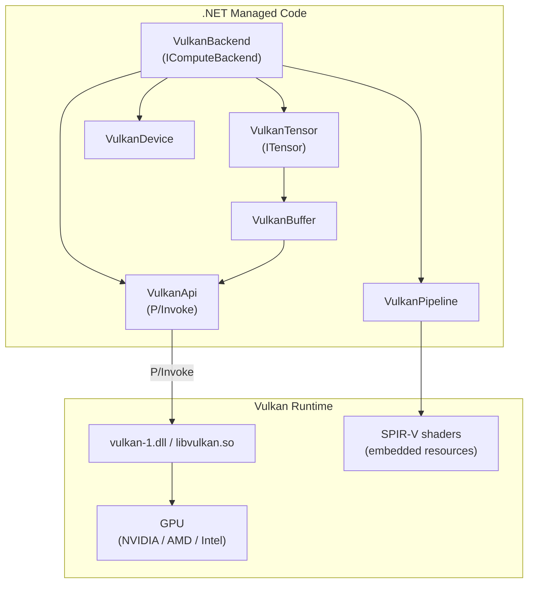
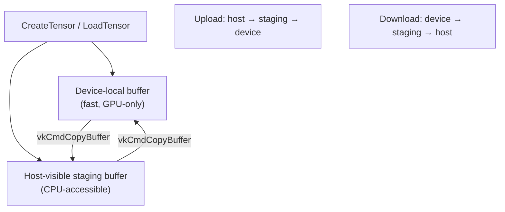
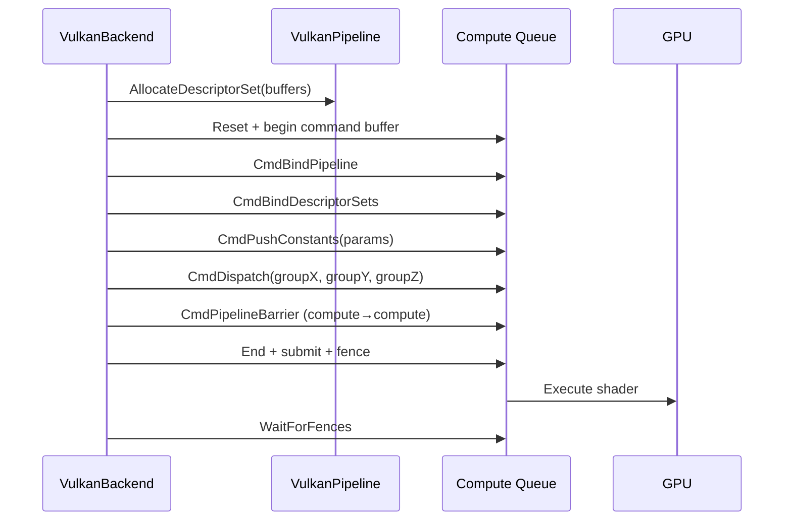

# Vulkan Compute Backend

> Cross-platform GPU inference via Vulkan compute shaders.
> [Definitions](definitions.md) | [Architecture](architecture.md) | [CUDA Backend](cuda-backend.md)

---

## Overview

The Vulkan backend (`Daisi.Llogos.Vulkan`) provides GPU-accelerated inference on any Vulkan-capable GPU — NVIDIA, AMD, or Intel. It uses the same `IComputeBackend` / `ITensor` abstractions as the CPU and CUDA backends, making it transparent to the inference engine.

Key differences from CUDA:
- **API style**: Vulkan uses explicit command buffer recording + fence-based synchronization instead of CUDA's imperative kernel launch model
- **Shader language**: GLSL compute shaders compiled to SPIR-V (vs CUDA C++ compiled via NVRTC)
- **Memory model**: Explicit memory types (device-local, host-visible) with staging buffer pattern for transfers
- **Vendor support**: Works on NVIDIA, AMD, Intel, Qualcomm (vs CUDA which is NVIDIA-only)

---

## Architecture



## Files

| File | Purpose |
|------|---------|
| `VulkanApi.cs` | P/Invoke declarations for ~40 Vulkan API functions |
| `VulkanStructs.cs` | Vulkan structures (VkBufferCreateInfo, VkMemoryRequirements, etc.) |
| `VulkanDevice.cs` | Instance + physical device + logical device + compute queue + command buffer |
| `VulkanBuffer.cs` | Device memory allocation with host-visible staging support |
| `VulkanPipeline.cs` | SPIR-V shader loading, compute pipeline, descriptor set management |
| `VulkanTensor.cs` | `ITensor` backed by device buffer + staging buffer |
| `VulkanBackend.cs` | `IComputeBackend` — dispatches compute shaders for all 23 operations |

## Compute Shaders

| Shader | Operations |
|--------|-----------|
| `elementwise.comp` | RMSNorm |
| `softmax.comp` | Numerically stable softmax |
| `silu.comp` | SiLU activation |
| `rope.comp` | Rotary position embeddings |
| `element_ops.comp` | Element-wise add/multiply |
| `dequant_matmul.comp` | Fused dequant+matmul (F32, Q8_0, Q4_0, Q4_1, Q4_K, Q5_K, Q6_K, I2_S, TQ1_0, F16) |
| `matmul_q8_0_aligned.comp` | Dedicated aligned Q8_0 matmul (optimized uint32 reads) |
| `dequant_matmul_bda.comp` | Buffer device address matmul variant |
| `embedding.comp` | Embedding lookup (F32, Q8_0, Q4_0, Q4_1, Q4_K, F16) |
| `composite_ops.comp` | SiLU in-place, SiLU gate, split QKV, de-interleave Q, L2 norm, per-head RMSNorm, KV cache write, compute decay/beta, causal conv1d |
| `gated_attention.comp` | Tiled gated attention with online softmax |
| `deltanet_step.comp` | DeltaNet state update + output + per-head RMSNorm |

GLSL shaders are compiled to SPIR-V at build time using `glslc` from the Vulkan SDK, then embedded as assembly resources.

## Memory Management



Every `VulkanTensor` maintains both a device-local buffer (for fast GPU access) and a host-visible staging buffer (for CPU transfers). Weight tensors are uploaded once at model load time. Logits are downloaded once per generated token.

## Dispatch Pattern

Every compute operation follows the same pattern:

1. Allocate a descriptor set from the pipeline's pool
2. Bind buffer handles to descriptor set bindings
3. Record command buffer: bind pipeline → bind descriptor set → push constants → dispatch
4. Submit command buffer to compute queue
5. Wait for fence



## CLI Usage

```bash
dotnet run --project src/Daisi.Llogos.Cli -- \
    --model C:\GGUFS\Qwen3.5-0.8B-Q8_0.gguf \
    --prompt "Hello, world" \
    --backend vulkan
```
